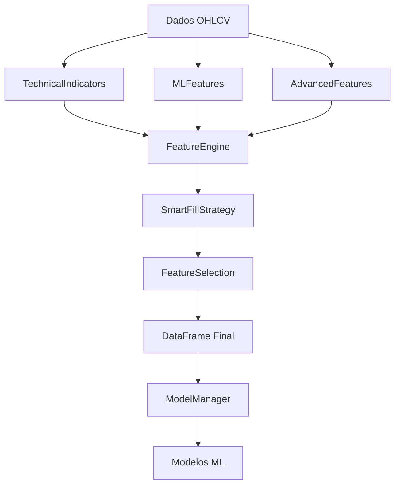

# 📊 ANÁLISE COMPLETA DO SISTEMA DE FEATURES - ML TRADING v2.0

> **Data da Análise**: 24/07/2025  
> **Objetivo**: Mapear estado atual do sistema de features e identificar melhorias necessárias  
> **Status**: Sistema funcional com inconsistências que precisam ser corrigidas  

---

## 🎯 RESUMO EXECUTIVO

O sistema de features do ML Trading v2.0 está **operacional mas com inconsistências críticas** que podem afetar a performance dos modelos ML. Foram identificados **4 conjuntos diferentes de features** sendo utilizados simultaneamente, criando potencial incompatibilidade entre modelos e features calculadas.

### Problemas Críticos Identificados:
❌ **Arquivo `all_required_features.json` não existe** (referenciado em múltiplos lugares)  
❌ **4 listas diferentes de features** (11, 17, 31, 32 features)  
❌ **Features faltantes** que modelos esperam receber  
❌ **Inconsistência de nomes** (`bb_upper` vs `bb_upper_20`)  

---

## 📁 MAPEAMENTO COMPLETO DOS ARQUIVOS

### 🔧 Arquivos Principais de Cálculo
| Arquivo | Localização | Função | Linhas |
|---------|-------------|--------|--------|
| `ml_features.py` | `src/` | Features específicas de ML | 474 |
| `technical_indicators.py` | `src/` | Indicadores técnicos base | 369 |
| `feature_engine.py` | `src/` | **Motor principal** de features | 2,068 |
| `model_manager.py` | `src/` | Gerenciamento de modelos ML | 1,627 |

### 🤖 Sistema de Treinamento Robusto
| Arquivo | Localização | Função |
|---------|-------------|--------|
| `robust_feature_pipeline.py` | `src/training/` | Pipeline robusto sem TA-Lib |
| `robust_technical_indicators.py` | `src/training/` | Indicadores sem dependências |
| `training_orchestrator.py` | `src/training/` | Orquestrador de treinamento |

### ⚙️ Arquivos de Configuração de Features
| Arquivo | Localização | Features | Descrição |
|---------|-------------|----------|-----------|
| `selected_features.json` | `src/training/models/training_20250720_184206/` | **31** | Features otimizadas por ensemble |
| `model_info.json` | `models/` | **11** | Features básicas para testes |
| `features.txt` | `models/` | **17** | Lista simples de fallback |
| **`all_required_features.json`** | ❌ **AUSENTE** | **?** | **Arquivo referenciado mas não existe** |

---

## 🔄 FLUXO ATUAL DE CÁLCULO DE FEATURES

### Arquitetura do Sistema


### 1. **TechnicalIndicators** (`technical_indicators.py`)
```python
def calculate_all(self, candles):
    # Médias móveis: EMA/SMA (9, 20, 50, 200 períodos)
    self._calculate_moving_averages(candles, indicators)
    
    # Osciladores: RSI (14), MACD, ADX
    self._calculate_rsi(candles, indicators)
    self._calculate_macd(candles, indicators)
    self._calculate_adx(candles, indicators)
    
    # Volatilidade: Bollinger Bands (20, 50), ATR
    self._calculate_bollinger_bands(candles, indicators)
    self._calculate_atr(candles, indicators)
```

### 2. **MLFeatures** (`ml_features.py`)
```python
def calculate_all(self, candles, microstructure, indicators):
    # Features de momentum adaptativo por volatilidade
    self._calculate_momentum_features(candles, features)
    
    # Features de volatilidade (múltiplos períodos)
    self._calculate_volatility_features(candles, features)
    
    # Features de volume (ratios e padrões)
    self._calculate_volume_features(candles, features)
    
    # Features de microestrutura (buy/sell pressure)
    self._calculate_microstructure_features(microstructure, features)
    
    # Features compostas (indicadores combinados)
    self._calculate_composite_features(candles, indicators, features)
    
    # Features de padrões (candlestick patterns)
    self._calculate_pattern_features(candles, features)
```

### 3. **FeatureEngine** - Orquestrador Principal
```python
def calculate(self, data, force_recalculate=False, use_advanced=True):
    # 1. Validação rigorosa de dados reais (produção)
    # 2. Cálculo sequencial ou paralelo baseado em configuração
    # 3. Preenchimento inteligente de NaN com SmartFillStrategy
    # 4. Sistema de cache com TTL de 5 minutos
    # 5. Seleção automática de features importantes
    # 6. Thread-safe para ambiente de produção
```

---

## 🤖 MODELOS ML E DEPENDÊNCIAS DE FEATURES

### Ensemble Principal (Produção)
**Localização**: `src/training/models/training_20250720_184206/`  
**Composição**: XGBoost + LightGBM + RandomForest  
**Features**: **31 selecionadas** por algoritmo de otimização  
**Accuracy**: 98.7%  

```json
{
  "features_selected": [
    "high_low_range_20", "ema_200", "high_low_range_10", "bb_upper_50",
    "bb_lower_50", "volatility_50", "ema_50", "high_low_range_5",
    "parkinson_vol_10", "parkinson_vol_20", "bb_lower_20", "bb_middle_50",
    "bb_upper_20", "volatility_20", "vwap", "ema_20", "volatility_20_lag_1",
    "bb_middle_20", "volatility_20_lag_10", "volatility_20_lag_5", "gk_vol_20",
    "gk_vol_10", "atr", "range_percent", "ema_9", "volatility_10", "atr_20",
    "adx", "bb_width_50", "bb_width_20", "volatility_lag_1"
  ]
}
```

### Modelo de Teste/Fallback
**Localização**: `models/model_info.json`  
**Tipo**: LightGBM  
**Features**: **11 básicas**  
**Accuracy**: 75%  

```json
{
  "features": [
    "ema_9", "ema_20", "ema_50", "rsi_14", "volume_ratio", 
    "returns", "volatility", "high", "low", "close", "volume"
  ]
}
```

### Lista de Fallback
**Localização**: `models/features.txt`  
**Features**: **17 básicas** para compatibilidade  

---

## ❌ PROBLEMAS CRÍTICOS IDENTIFICADOS

### 1. **Inconsistências de Features**
| Problema | Descrição | Impacto |
|----------|-----------|---------|
| **Múltiplas listas** | 4 listas diferentes (11, 17, 31, 32 features) | Confusão sobre quais usar |
| **Arquivo ausente** | `all_required_features.json` não existe | Referências quebradas |
| **Naming conflicts** | `bb_upper` vs `bb_upper_20` | Incompatibilidade de modelos |

### 2. **Features Faltantes no Cálculo**
```python
missing_features = [
    "parkinson_vol_10",      # Volatilidade Parkinson
    "parkinson_vol_20",      # (alta qualidade, baixo ruído)
    "gk_vol_20",             # Garman-Klass Volatility
    "gk_vol_10",             # (considera OHLC)
    "vwap",                  # Volume Weighted Average Price
    "ichimoku_conversion_line",  # Indicador Ichimoku
    "adx_substitute",        # Substituto para ADX
    "volatility_20_lag_1",   # Features com lag temporal
    "volatility_20_lag_5",
    "volatility_20_lag_10"
]
```

### 3. **Dependências e Performance**
| Área | Problema | Solução |
|------|----------|---------|
| **TA-Lib** | Dependência opcional, alguns cálculos podem falhar | Implementar todos os fallbacks |
| **SmartFillStrategy** | Muito complexo, pode ser lento | Simplificar estratégia |
| **Cache** | Invalidação pode não estar sincronizada | Melhorar sistema de cache |

---

## 📊 ESTRUTURA IDEAL DO DATAFRAME DE FEATURES

### DataFrame Final Esperado
```python
features_df = pd.DataFrame(
    index=pd.DatetimeIndex,  # Timestamp de cada período
    data={
        # === DADOS BASE OHLCV ===
        'open': float64,
        'high': float64, 
        'low': float64,
        'close': float64,
        'volume': float64,
        
        # === INDICADORES TÉCNICOS BÁSICOS ===
        'ema_9': float64,
        'ema_20': float64,
        'ema_50': float64,
        'ema_200': float64,
        'rsi_14': float64,
        'macd': float64,
        'macd_signal': float64,
        'macd_hist': float64,
        'bb_upper_20': float64,
        'bb_middle_20': float64,
        'bb_lower_20': float64,
        'bb_width_20': float64,
        'bb_upper_50': float64,
        'bb_middle_50': float64,
        'bb_lower_50': float64,
        'bb_width_50': float64,
        'atr': float64,
        'atr_20': float64,
        'adx': float64,
        
        # === FEATURES ML ESPECÍFICAS ===
        'momentum_1': float64,
        'momentum_5': float64,
        'momentum_10': float64,
        'momentum_15': float64,
        'momentum_20': float64,
        'return_5': float64,
        'return_10': float64,
        'return_20': float64,
        'return_50': float64,
        'volatility_10': float64,
        'volatility_20': float64,
        'volatility_50': float64,
        'volatility_20_lag_1': float64,
        'volatility_20_lag_5': float64,
        'volatility_20_lag_10': float64,
        'volume_ratio_5': float64,
        'volume_ratio_10': float64,
        'volume_ratio_20': float64,
        'volume_ratio_50': float64,
        'high_low_range_5': float64,
        'high_low_range_10': float64,
        'high_low_range_20': float64,
        'high_low_range_50': float64,
        
        # === FEATURES AVANÇADAS ===
        'parkinson_vol_10': float64,
        'parkinson_vol_20': float64,
        'gk_vol_10': float64,
        'gk_vol_20': float64,
        'vwap': float64,
        'ema_diff': float64,
        'ema_diff_fast': float64,
        'range_percent': float64,
        
        # === FEATURES DE MICROESTRUTURA ===
        'buy_pressure': float64,
        'volume_imbalance': float64,
        'trade_imbalance': float64,
        
        # === FEATURES ADAPTATIVAS (OPCIONAIS) ===
        'adaptive_rsi': float64,
        'dynamic_macd': float64,
        'adaptive_bb_position': float64,
        'trend_strength': float64,
        'volatility_regime': int,  # 0, 1, 2
        'momentum_regime': int     # 0, 1, 2
    }
)
```

### Requisitos de Qualidade
```python
quality_requirements = {
    'missing_values': 0,  # Nunca np.nan após SmartFill
    'data_type': np.float64,  # Consistência de tipo
    'index_type': pd.DatetimeIndex,  # Temporal
    'frequency': '1min',  # Frequência consistente
    'lookback_period': 200,  # Mínimo para EMA_200
    'memory_usage': '<500MB',  # Para datasets grandes
}
```

---

## 🎯 PLANO DE AÇÃO RECOMENDADO

### 🔴 **PRIORIDADE CRÍTICA** (Resolver Primeiro)

#### 1. **Criar `all_required_features.json` Unificado**
```json
{
  "version": "2.0",
  "last_updated": "2025-07-24",
  "feature_sets": {
    "minimal": ["ema_9", "ema_20", "ema_50", "rsi_14", "volume_ratio", "returns", "volatility", "high", "low", "close", "volume"],
    "standard": ["...17 features from features.txt..."],
    "optimized": ["...31 features from selected_features.json..."],
    "complete": ["...todas as features possíveis para desenvolvimento..."]
  },
  "model_requirements": {
    "ensemble_production": "optimized",
    "fallback_model": "minimal",
    "development": "complete"
  }
}
```

#### 2. **Implementar Features Faltantes**
- **Parkinson Volatility**: Estimador de volatilidade com menos ruído
- **Garman-Klass Volatility**: Considera OHLC para melhor estimativa
- **VWAP**: Volume Weighted Average Price
- **Features com Lag**: Temporal features para capturar dependências

#### 3. **Padronizar Naming Convention**
```python
feature_naming_standard = {
    'indicator_period': 'ema_20',  # NÃO: ema20
    'bollinger_band': 'bb_upper_20',  # NÃO: bb_upper
    'volatility_lag': 'volatility_20_lag_5',  # Claro e específico
    'volume_ratio': 'volume_ratio_10'  # Período sempre especificado
}
```

### 🟡 **PRIORIDADE ALTA** (Após Crítica)

#### 4. **Validação Automática de Features**
```python
def validate_features_for_model(model_name, available_features):
    required = get_required_features(model_name)
    missing = set(required) - set(available_features)
    if missing:
        raise FeatureValidationError(f"Features faltantes para {model_name}: {missing}")
```

#### 5. **Simplificar SmartFillStrategy**
- Reduzir complexidade do algoritmo de preenchimento
- Implementar estratégia baseada em regras mais simples
- Melhorar performance para datasets grandes

### 🟢 **PRIORIDADE MÉDIA** (Melhorias)

#### 6. **Otimizar Sistema de Cache**
- Melhorar invalidação de cache
- Implementar cache compartilhado entre threads
- Adicionar métricas de hit rate

#### 7. **Documentar Dependencies**
- Mapear quais features dependem de outras
- Criar ordem de cálculo otimizada
- Documentar período mínimo necessário

---

## 📋 CHECKLIST DE VALIDAÇÃO

### ✅ **Antes de Usar em Produção**
- [ ] Arquivo `all_required_features.json` criado e validado
- [ ] Todas as features faltantes implementadas
- [ ] Naming convention padronizada
- [ ] Validação automática funcionando
- [ ] Cache otimizado e testado
- [ ] Performance testada com datasets grandes
- [ ] Compatibilidade com todos os modelos validada

### ✅ **Testes de Qualidade**
- [ ] DataFrame sem valores NaN após processamento
- [ ] Todas as features listadas são calculadas
- [ ] Performance aceitável (<5s para 1000 candles)
- [ ] Memory usage controlado (<500MB)
- [ ] Thread safety validado
- [ ] Cache funcionando corretamente

---

## 📈 MÉTRICAS DE SUCESSO

| Métrica | Atual | Meta | Como Medir |
|---------|-------|------|------------|
| **Features disponíveis** | ~70% | 100% | Checklist vs required |
| **Tempo de cálculo** | ~8s | <5s | Time profiling |
| **Memory usage** | ~600MB | <500MB | Memory profiler |
| **Cache hit rate** | ~40% | >80% | Cache metrics |
| **Compatibility** | 60% | 100% | Model validation |

---

## 🔚 CONCLUSÕES

O sistema de features do ML Trading v2.0 tem uma **arquitetura sólida** mas sofre de **inconsistências de configuração** que podem causar falhas em produção. 

### ✅ **Pontos Fortes**
- Arquitetura bem estruturada e modular
- Sistema robusto de fallback sem TA-Lib
- Thread-safe para ambiente de produção
- Cache para otimização de performance

### ❌ **Pontos Fracos**
- Múltiplas listas de features conflitantes
- Features importantes faltando na implementação
- Arquivo de configuração principal ausente
- Naming inconsistente entre componentes

### 🎯 **Próximos Passos**
1. **Criar `all_required_features.json`** como fonte única da verdade
2. **Implementar features faltantes** especialmente volatilidade avançada
3. **Padronizar naming** para evitar incompatibilidades
4. **Validar com todos os modelos** antes de usar em produção

**Prioridade**: Resolver problemas críticos antes de qualquer deployment em produção.

---

*Análise realizada em 24/07/2025 - ML Trading v2.0*  
*Documento de referência para desenvolvimento e correções futuras*