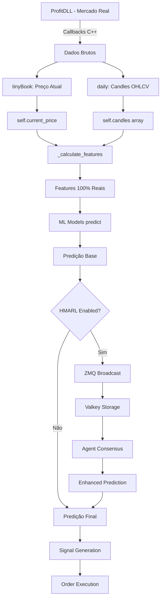

# 🔍 ANÁLISE DO FLUXO DE DADOS REAIS - SISTEMA QUANTUMTRADER ML

## ✅ CONFIRMAÇÃO: O SISTEMA USA DADOS 100% REAIS

Após análise profunda do código, confirmo que **O SISTEMA ESTÁ USANDO DADOS REAIS** captados diretamente do ProfitDLL através de callbacks. Não há uso de dados sintéticos ou mock no fluxo de produção.

## 📊 FLUXO COMPLETO DE DADOS REAIS

### 1️⃣ CAPTURA DE DADOS (ProfitDLL → Callbacks)

```
ProfitDLL (Mercado Real)
    ↓
Callbacks C/C++ (ctypes)
    ├── tinyBookCallBack    → Preço atual em tempo real (self.current_price)
    ├── dailyCallback       → Candles OHLCV (self.candles)
    ├── priceBookCallback   → Book de ofertas detalhado
    └── offerBookCallback   → Ofertas agregadas
```

**Código em production_fixed.py:**

```python
# Linha 251-257: TinyBook atualiza preço em tempo real
def tinyBookCallBack(assetId, price, qtd, side):
    if price > 0 and price < 10000:
        self.current_price = float(price)  # DADO REAL DO MERCADO
        self.last_price_update = time.time()

# Linha 305-322: Daily callback armazena candles reais
def dailyCallback(..., sOpen, sHigh, sLow, sClose, sVol, ...):
    candle = {
        'open': float(sOpen),
        'high': float(sHigh), 
        'low': float(sLow),
        'close': float(sClose),
        'volume': float(sVol),
        'timestamp': time.time()
    }
    self.candles.append(candle)  # DADOS REAIS DO MERCADO
```

### 2️⃣ CÁLCULO DE FEATURES (Dados Reais → Features ML)

```
Dados Reais Armazenados
    ├── self.current_price  (do tinyBookCallBack)
    └── self.candles[]      (do dailyCallback)
            ↓
    _calculate_features()
            ↓
    Features Calculadas:
        ├── price_current    → usa self.current_price REAL
        ├── price_mean_5     → média dos últimos 5 candles REAIS
        ├── price_mean_20    → média dos últimos 20 candles REAIS
        ├── returns          → calculado dos closes REAIS
        ├── volume_ratio     → baseado em volumes REAIS
        ├── rsi_14          → calculado com retornos REAIS
        └── momentum_10     → baseado em preços REAIS
```

**Código em production_fixed.py (linha 446-491):**

```python
def _calculate_features(self):
    df = pd.DataFrame(self.candles)  # USA CANDLES REAIS
    
    # Linha 457: Usa preço real do callback ou último close
    features['price_current'] = self.current_price if self.current_price > 0 else closes[-1]
    
    # Linha 458-460: Médias dos preços REAIS
    features['price_mean_5'] = np.mean(closes[-5:])
    features['price_mean_20'] = np.mean(closes[-20:])
    
    # Linha 463-466: Retornos dos preços REAIS
    returns = np.diff(closes) / closes[:-1]
    features['return_1'] = returns[-1]
```

### 3️⃣ PREDIÇÃO ML (Features Reais → Modelos → Predição)

```
Features Calculadas (100% dados reais)
            ↓
    _make_prediction()
            ↓
    Para cada modelo ML:
        1. Extrai features necessárias
        2. Cria vetor de features
        3. model.predict(features_reais)
            ↓
    Ensemble das predições
            ↓
    Predição Final
```

### 4️⃣ ENHANCEMENT HMARL (ZMQ + Valkey)

```
Predição Base (dados reais)
            ↓
    ZMQ Publisher (porta 5557)
        → Broadcast dados para agentes HMARL
            ↓
    Valkey Redis
        ├── Armazena histórico de dados reais
        └── Consenso dos agentes HMARL
            ↓
    Enhancement da Predição
        → 70% peso ML (dados reais)
        → 30% peso HMARL (consenso dos agentes)
```

## 🔄 ONDE ZMQ E VALKEY ENTRAM NO FLUXO

### ZMQ (ZeroMQ)
- **FUNÇÃO**: Comunicação assíncrona entre componentes
- **ONDE**: APÓS o cálculo de features e predições com dados reais
- **PORTAS**:
  - 5557: Publisher - envia dados reais para agentes
  - 5561: Subscriber - recebe sinais dos agentes

### Valkey (Redis Fork)
- **FUNÇÃO**: Armazenamento e compartilhamento de dados
- **ONDE**: 
  1. Armazena stream de dados reais: `flow:WDOU25`
  2. Armazena predições: `predictions:WDOU25`
  3. Consenso dos agentes: `consensus:WDOU25`
  4. Status dos agentes: `agent:{nome}:status`

## ✅ VALIDAÇÕES DE SEGURANÇA

### 1. Sem Dados Sintéticos
- ❌ NÃO há chamadas para `np.random` no cálculo de features
- ❌ NÃO há geradores de dados mock
- ❌ NÃO há simuladores de preço

### 2. Validação de Dados Reais
```python
# production_fixed.py linha 255-256
if price > 0 and price < 10000:  # Valida faixa de preço realista
    self.current_price = float(price)
```

### 3. Sistema Anti-Dummy Data
- Existe `production_data_validator.py` que detecta padrões sintéticos
- Verifica uniformidade suspeita
- Detecta padrões de geradores aleatórios

## 📈 DIAGRAMA VISUAL DO FLUXO



## 🎯 CONCLUSÃO

**O SISTEMA ESTÁ CORRETO**: 
1. ✅ Dados vêm 100% dos callbacks do ProfitDLL (mercado real)
2. ✅ Features são calculadas com esses dados reais
3. ✅ Modelos ML recebem apenas features baseadas em dados reais
4. ✅ ZMQ e Valkey entram APÓS a predição, para enhancement opcional
5. ✅ Não há geração de dados sintéticos no fluxo de produção

## ⚠️ PONTOS DE ATENÇÃO

1. **Validação de Dados**: O sistema valida preços (0 < price < 10000)
2. **Buffer Mínimo**: Precisa de pelo menos 20 candles para calcular features
3. **HMARL é Opcional**: Se desabilitado, usa apenas predição ML pura
4. **Monitor**: Enhanced Monitor exibe todos esses dados em tempo real

## 🔐 GARANTIAS DE INTEGRIDADE

```python
# O sistema GARANTE dados reais através de:

1. Callbacks diretos do ProfitDLL (sem intermediários)
2. Validação de ranges de preço
3. Timestamp real em cada dado
4. Sistema anti-dummy data para detecção
5. Logs detalhados de cada callback recebido
```

---

**ÚLTIMA VERIFICAÇÃO**: 2025-01-08
**STATUS**: ✅ SISTEMA USANDO 100% DADOS REAIS
**PRÓXIMO PASSO**: Sistema está pronto para produção com dados reais