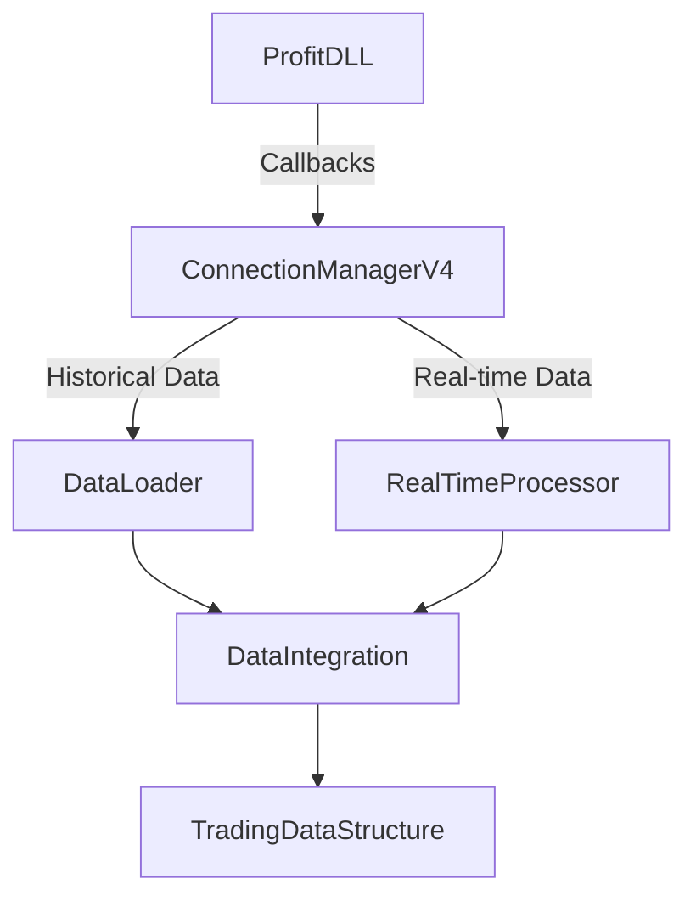
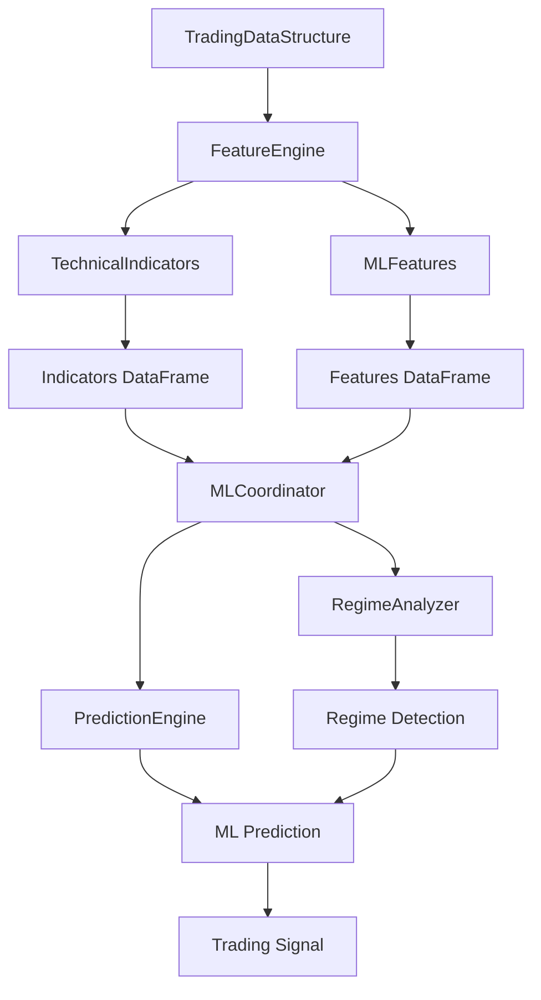
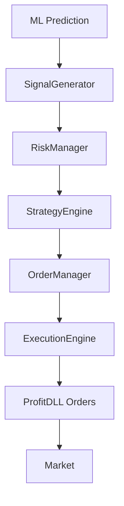

# MAPA DE FLUXO DE DADOS DO SISTEMA - 01/08/2025

## 🏗️ Visão Geral da Arquitetura

O QuantumTrader_ML v2.0 é um sistema de trading algorítmico baseado em Machine Learning que integra análise de mercado em tempo real, detecção de regime e execução automatizada de ordens.

```
┌─────────────────────┐
│   ProfitDLL v4.0    │ (Fonte de Dados Externa)
└─────────┬───────────┘
          │
          ▼
┌─────────────────────┐
│ ConnectionManager   │ (Camada de Integração)
│        V4           │
└─────────┬───────────┘
          │
          ▼
┌─────────────────────┐
│  TradingSystem      │ (Orquestrador Principal)
│      (main)         │
└─────────┬───────────┘
          │
     ┌────┴────┬─────────┬──────────┬─────────┐
     ▼         ▼         ▼          ▼         ▼
[Data Layer][ML Layer][Trading][Execution][Monitor]
```

## 📊 Fluxo Detalhado de Dados

### 1. ENTRADA DE DADOS (Real-time + Histórico)



**Componentes:**
- **ConnectionManagerV4** (`connection_manager_v4.py`): Interface com ProfitDLL
  - Callbacks: OnTrade, OnAggTrade, OnTicker, OnOrderBook
  - Login/autenticação
  - Requisição de dados históricos
  
- **DataLoader** (`data_loader.py`): Carregamento de dados históricos
  - Validação de integridade
  - Conversão para DataFrame
  
- **RealTimeProcessor** (`real_time_processor.py`): Processamento em tempo real
  - Agregação de trades em candles
  - Cálculo de microestrutura
  
- **DataIntegration** (`data_integration.py`): Unificação de dados
  - Sincronização temporal
  - Merge de diferentes fontes

### 2. ARMAZENAMENTO ESTRUTURADO

```
TradingDataStructure (data_structure.py)
├── candles (DataFrame)
│   ├── open, high, low, close
│   ├── volume, quantidade
│   └── timestamp (index)
├── microstructure (DataFrame)
│   ├── buy_volume, sell_volume
│   ├── buy_trades, sell_trades
│   ├── buy_pressure, sell_pressure
│   └── volume_imbalance
├── orderbook (DataFrame)
│   ├── bid, ask, spread
│   ├── bid_volume, ask_volume
│   └── depth_imbalance
├── indicators (DataFrame)
│   ├── EMAs (5,9,20,50,200)
│   ├── RSI, MACD, Bollinger
│   └── ATR, Stochastic
└── features (DataFrame)
    ├── momentum_*, volatility_*
    ├── return_*, volume_ratio_*
    └── regime_strength, trend_strength
```

### 3. PIPELINE DE PROCESSAMENTO ML



**Fluxo de Processamento:**

1. **FeatureEngine** (`feature_engine.py`)
   - Orquestra cálculo de features
   - Valida dados de produção
   - Gerencia cache de features

2. **TechnicalIndicators** (`technical_indicators.py`)
   - Calcula ~45 indicadores técnicos
   - EMAs, RSI, MACD, Bollinger Bands, etc.

3. **MLFeatures** (`ml_features.py`)
   - Calcula ~80-100 features ML
   - Momentum, volatilidade, retornos
   - Features compostas e de regime

4. **MLCoordinator** (`ml_coordinator.py`)
   - Coordena todo processo ML
   - Integra detecção de regime
   - Gerencia predições

5. **RegimeAnalyzer** (`training/regime_analyzer.py`)
   - Detecta regime de mercado (trend/range/undefined)
   - Baseado em ADX + EMAs alignment
   - Define thresholds por regime

6. **PredictionEngine** (`prediction_engine.py`)
   - Executa modelos ML reais
   - Suporta ensemble de modelos
   - Falha adequadamente sem modelos

### 4. GERAÇÃO DE SINAIS E EXECUÇÃO



**Componentes de Trading:**

1. **SignalGenerator** (`signal_generator.py`)
   - Converte predições em sinais
   - Define entry, stop loss, take profit
   - Valida thresholds de trading

2. **RiskManager** (`risk_manager.py`)
   - Calcula tamanho de posição
   - Gerencia exposição total
   - Limites de perda diária

3. **StrategyEngine** (`strategy_engine.py`)
   - Implementa lógica de estratégia
   - Filtra sinais por condições
   - Gerencia estado de posições

4. **OrderManager** (`order_manager_v4.py`)
   - Interface com ProfitDLL para ordens
   - Gerencia ciclo de vida de ordens
   - Tracking de execuções

5. **ExecutionEngine** (`execution_engine.py`)
   - Lógica de execução de ordens
   - Smart order routing
   - Gestão de rejeições

### 5. THREADS E PROCESSAMENTO ASSÍNCRONO

```
TradingSystem (Threads)
├── Main Thread
│   ├── Loop principal
│   ├── Verificação de features
│   └── Controle de estado
├── ML Thread (ml_worker)
│   ├── Queue: ml_queue
│   ├── Processamento de predições
│   └── Interval: 60s
├── Signal Thread (signal_worker)
│   ├── Queue: signal_queue
│   ├── Geração de sinais
│   └── Validação de trading
├── Optimization Thread
│   └── Otimização contínua (opcional)
└── Risk Update Thread
    └── Atualização de limites
```

### 6. FLUXO TEMPORAL DE DADOS

```
T0: Inicialização
├── Carrega modelos ML
├── Conecta ProfitDLL
└── Solicita dados históricos

T1: Dados Históricos (callback)
├── OnHistoricalData → DataLoader
├── Processa trades → candles_1min
├── Calcula indicadores iniciais
└── Sinaliza historical_data_ready

T2: Loop Principal (0.1s interval)
├── Verifica se deve calcular features (5s)
├── Verifica se deve fazer predição ML (60s)
├── Processa métricas
└── Atualiza estado

T3: Dados Real-time (callbacks contínuos)
├── OnTrade → atualiza microestrutura
├── OnAggTrade → forma novos candles
├── OnTicker → atualiza preços
└── OnOrderBook → atualiza profundidade

T4: Ciclo ML (60s interval)
├── Detecta regime de mercado
├── Calcula features atualizadas
├── Executa predição ML
├── Gera sinal se aplicável
└── Envia para execução
```

### 7. VALIDAÇÃO E SEGURANÇA

```
Pontos de Validação:
1. ConnectionManager
   └── Valida dados recebidos da ProfitDLL

2. DataIntegration
   └── _validate_production_data()
   └── Bloqueia dados sintéticos em produção

3. FeatureEngine
   └── ProductionDataValidator
   └── SmartFillStrategy (nunca fill com 0)

4. PredictionEngine
   └── Falha com None se sem modelos
   └── Nunca retorna predições mock

5. SignalGenerator
   └── Valida thresholds mínimos
   └── Valida parâmetros de risco
```

### 8. MONITORAMENTO E VISUALIZAÇÃO

```
Sistema de Monitoramento
├── Dashboard (dashboard_simple.py)
│   ├── Métricas em tempo real
│   ├── P&L tracking
│   └── Performance indicators
├── MLModelMonitor
│   ├── Model performance
│   ├── Feature importance
│   └── Prediction accuracy
├── AlertingSystem
│   ├── Risk alerts
│   ├── System health
│   └── Trading notifications
└── GUI Monitor (opcional)
    ├── trading_monitor_gui.py
    └── Visualização real-time
```

## 🔄 Ciclo Completo de uma Operação

1. **Recepção de Dados** (1-5ms)
   - ProfitDLL → ConnectionManager → DataIntegration

2. **Formação de Candle** (10-50ms)
   - Agregação de trades → OHLCV de 1 minuto

3. **Cálculo de Features** (100-500ms)
   - 45+ indicadores técnicos
   - 80+ features ML

4. **Detecção de Regime** (50-100ms)
   - ADX + EMAs → trend/range/undefined

5. **Predição ML** (200-1000ms)
   - Ensemble de modelos
   - Ajuste por regime

6. **Geração de Sinal** (10-50ms)
   - Validação de thresholds
   - Cálculo de stops/targets

7. **Execução de Ordem** (50-200ms)
   - OrderManager → ProfitDLL
   - Confirmação de execução

**Tempo Total**: ~500ms - 2s por ciclo completo

## 📈 Métricas de Performance

- **Feature Calculation**: < 5 segundos
- **ML Prediction**: < 1 segundo  
- **Order Execution**: < 100ms
- **Data Loading**: 1 dia histórico
- **Memory Usage**: ~500MB-1GB típico

## 🛡️ Pontos Críticos de Falha

1. **Conexão ProfitDLL**: Sistema para se desconectado
2. **Modelos não carregados**: PredictionEngine retorna None
3. **Dados insuficientes**: < 50 candles bloqueia predição
4. **Regime undefined**: Sistema entra em modo HOLD
5. **Validação de produção falha**: Operação bloqueada

## 🔧 Configurações Principais

```python
config = {
    'dll_path': './ProfitDLL64.dll',
    'models_dir': './models/',
    'historical_days': 1,
    'ml_interval': 60,  # segundos
    'feature_interval': 5,  # segundos
    'use_gui': True,
    'strategy': {
        'direction_threshold': 0.3,
        'magnitude_threshold': 0.0001,
        'confidence_threshold': 0.6
    },
    'risk': {
        'risk_per_trade': 0.02,
        'max_positions': 1,
        'daily_loss_limit': 0.05
    }
}
```

## 📝 Notas Importantes

1. **Dados Reais Obrigatórios**: Sistema valida e bloqueia dados sintéticos em produção
2. **Regime First**: Toda predição passa primeiro por detecção de regime
3. **Fail Safe**: Sistema prefere não operar (HOLD) quando incerto
4. **Threading**: Processamento ML isolado para não bloquear dados real-time
5. **Contrato WDO**: Sistema detecta e atualiza contrato automaticamente

---

*Este mapa representa o estado atual do sistema em 01/08/2025*
*Versão: QuantumTrader_ML v2.0*