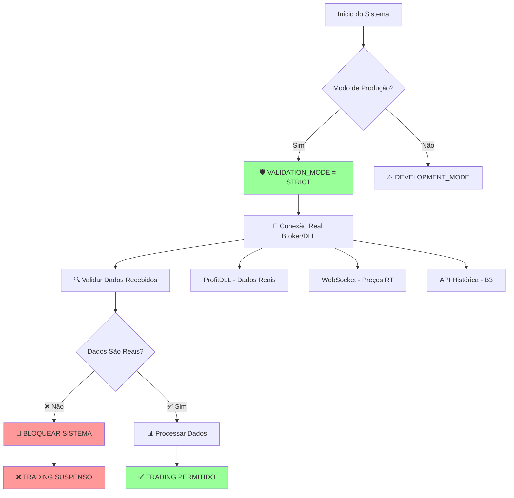

# 🛡️ FLUXO DE DADOS SEGURO PARA PRODUÇÃO - ML Trading v2.0
# Mapeamento Atualizado com Validações de Segurança

**Data**: 19 de Julho de 2025  
**Status**: 🛡️ PRODUÇÃO SEGURA - DADOS REAIS OBRIGATÓRIOS  
**Versão**: 2.0 - ANTI-DUMMY DATA

---

## 🎯 **PRINCÍPIOS FUNDAMENTAIS**

### ✅ **DADOS REAIS OBRIGATÓRIOS**
```
🚨 REGRA CRÍTICA: NENHUM DADO SINTÉTICO, DUMMY OU MOCK EM PRODUÇÃO
🚨 VALIDAÇÃO: Todo dado deve ser verificado como real antes do uso
🚨 BLOQUEIO: Sistema deve parar se detectar dados não-reais
```

---

## 📊 **FLUXO DE DADOS COM VALIDAÇÃO SEGURA**

### **ETAPA 1: ENTRADA DE DADOS - PONTOS CRÍTICOS** 🔴



### **ETAPA 2: VALIDAÇÃO DE DADOS ENTRADA** 🛡️

```python
class ProductionDataValidator:
    """Validador rigoroso para dados de produção"""
    
    @staticmethod
    def validate_real_data(data: pd.DataFrame, source: str) -> bool:
        """
        Valida se dados são reais e não sintéticos
        
        Args:
            data: DataFrame com dados de mercado
            source: Fonte dos dados ('dll', 'websocket', 'api')
            
        Returns:
            bool: True se dados são válidos para produção
            
        Raises:
            ProductionDataError: Se dados dummy detectados
        """
        
        # 🔍 1. VERIFICAR PADRÕES SINTÉTICOS
        if ProductionDataValidator._detect_synthetic_patterns(data):
            raise ProductionDataError(
                f"DADOS SINTÉTICOS DETECTADOS EM {source.upper()}"
                "OPERAÇÃO BLOQUEADA PARA SEGURANÇA"
            )
        
        # 🔍 2. VERIFICAR TIMESTAMPS REAIS
        if ProductionDataValidator._validate_timestamps(data):
            raise ProductionDataError(
                f"TIMESTAMPS SUSPEITOS EM {source.upper()}"
                "DADOS PODEM NÃO SER REAIS"
            )
            
        # 🔍 3. VERIFICAR INTEGRIDADE DOS PREÇOS
        if ProductionDataValidator._validate_price_integrity(data):
            raise ProductionDataError(
                f"PREÇOS SUSPEITOS EM {source.upper()}"
                "POSSÍVEL USO DE DADOS SIMULADOS"
            )
            
        # 🔍 4. VERIFICAR VOLUME REAL
        if ProductionDataValidator._validate_volume_patterns(data):
            raise ProductionDataError(
                f"VOLUME SUSPEITO EM {source.upper()}"
                "PADRÃO CONSISTENTE COM DADOS DUMMY"
            )
        
        return True
    
    @staticmethod
    def _detect_synthetic_patterns(data: pd.DataFrame) -> bool:
        """Detecta padrões típicos de dados sintéticos"""
        
        # ❌ Detectar uso de np.random com seed
        if 'volume' in data.columns:
            volume_std = data['volume'].std()
            volume_mean = data['volume'].mean()
            
            # Padrão suspeito: volume muito uniforme
            if volume_std / volume_mean < 0.1:
                return True
                
        # ❌ Detectar preços com padrões de random normal
        if all(col in data.columns for col in ['high', 'low', 'close']):
            # Spread muito constante = dados fake
            spread = (data['high'] - data['low']) / data['close']
            if spread.std() < 0.0001:  # Spread muito uniforme
                return True
                
        # ❌ Detectar sequência de IDs suspeitos
        if 'trade_id' in data.columns:
            if data['trade_id'].is_monotonic_increasing:
                # IDs sequenciais = possível simulação
                return True
                
        return False
    
    @staticmethod
    def _validate_timestamps(data: pd.DataFrame) -> bool:
        """Valida se timestamps são de dados reais"""
        
        if not hasattr(data.index, 'tz'):
            return True  # Sem timezone = suspeito
            
        # Verificar se dados são muito antigos
        latest_time = data.index.max()
        time_diff = datetime.now() - latest_time.replace(tzinfo=None)
        
        if time_diff > timedelta(minutes=10):
            return True  # Dados muito antigos para tempo real
            
        return False
        
    @staticmethod 
    def _validate_price_integrity(data: pd.DataFrame) -> bool:
        """Valida integridade dos preços"""
        
        if 'close' not in data.columns:
            return False
            
        # ❌ Detectar preços zeros ou negativos
        if (data['close'] <= 0).any():
            return True
            
        # ❌ Detectar mudanças impossíveis (>20% em 1 minuto)
        price_changes = data['close'].pct_change().abs()
        if (price_changes > 0.2).any():
            return True
            
        return False
        
    @staticmethod
    def _validate_volume_patterns(data: pd.DataFrame) -> bool:
        """Valida padrões de volume real"""
        
        if 'volume' not in data.columns:
            return False
            
        # ❌ Volume zero constante
        if (data['volume'] == 0).all():
            return True
            
        # ❌ Volume uniforme demais (padrão de simulação)
        if data['volume'].nunique() < len(data) * 0.8:
            return True
            
        return False


class ProductionDataError(Exception):
    """Exceção para dados não-produção detectados"""
    pass
```

### **ETAPA 3: PONTOS DE ENTRADA CRÍTICOS MAPEADOS** 🔴

```python
# 🔴 PONTO CRÍTICO 1: data_loader.py
class ProductionDataLoader:
    """Substituição do DataLoader com dados dummy"""
    
    def __init__(self):
        self.validator = ProductionDataValidator()
        self.production_mode = os.getenv('TRADING_PRODUCTION_MODE', 'False').lower() == 'true'
        
    def load_historical_data(self, symbol: str, days: int = 30) -> pd.DataFrame:
        """
        ❌ ANTIGO: Gerava dados sintéticos
        ✅ NOVO: Apenas dados reais de API/Banco
        """
        
        if self.production_mode:
            # 🔴 PRODUÇÃO: Apenas dados reais
            data = self._fetch_real_historical_data(symbol, days)
            self.validator.validate_real_data(data, 'historical_api')
            return data
        else:
            # ⚠️ DESENVOLVIMENTO: Permitir simulação com aviso
            logger.warning("MODO DESENVOLVIMENTO - DADOS PODEM SER SINTÉTICOS")
            return self._fetch_development_data(symbol, days)
            
    def _fetch_real_historical_data(self, symbol: str, days: int) -> pd.DataFrame:
        """Busca dados reais via API B3/Corretora"""
        
        # Implementação real da API
        # TODO: Integrar com API real da B3 ou corretora
        
        api_client = B3APIClient()  # Implementar
        data = api_client.get_historical_data(symbol, days)
        
        if data.empty:
            raise ProductionDataError("API não retornou dados históricos reais")
            
        return data

# 🔴 PONTO CRÍTICO 2: trading_system.py  
class ProductionTradingSystem:
    """Sistema de trading apenas com dados reais"""
    
    def __init__(self):
        self.production_mode = True  # Sempre True em produção
        self.validator = ProductionDataValidator()
        
    def process_market_data(self, market_data: Dict) -> Dict:
        """
        ❌ ANTIGO: Podia usar dados simulados
        ✅ NOVO: Apenas dados reais validados
        """
        
        # 🛡️ VALIDAÇÃO OBRIGATÓRIA
        if self.production_mode:
            self._validate_production_data(market_data)
            
        return self._process_validated_data(market_data)
        
    def _validate_production_data(self, data: Dict) -> None:
        """Validação rigorosa para produção"""
        
        required_fields = ['timestamp', 'price', 'volume', 'source']
        
        for field in required_fields:
            if field not in data:
                raise ProductionDataError(f"Campo obrigatório {field} ausente")
                
        # Verificar fonte dos dados
        valid_sources = ['ProfitDLL', 'WebSocketReal', 'B3API']
        if data['source'] not in valid_sources:
            raise ProductionDataError(f"Fonte não autorizada: {data['source']}")
            
        # Timestamp deve ser recente (< 5 segundos)
        timestamp_diff = time.time() - data['timestamp']
        if timestamp_diff > 5:
            raise ProductionDataError("Dados muito antigos para trading real")

# 🔴 PONTO CRÍTICO 3: connection_manager.py
class ProductionConnectionManager:
    """Gerencia apenas conexões reais"""
    
    def __init__(self):
        self.mock_mode = False  # NUNCA True em produção
        self.validator = ProductionDataValidator()
        
    def get_real_time_data(self) -> Dict:
        """
        ❌ ANTIGO: Podia retornar dados mock
        ✅ NOVO: Apenas DLL real ou WebSocket real
        """
        
        if self.mock_mode:
            raise ProductionDataError(
                "MODO MOCK DETECTADO - PRODUÇÃO BLOQUEADA"
            )
            
        # Apenas conexão real com DLL
        dll_data = self._get_dll_data()
        self.validator.validate_real_data(dll_data, 'ProfitDLL')
        
        return dll_data
```

### **ETAPA 4: FEATURE ENGINE SEGURO** 🛡️

```python
class ProductionFeatureEngine:
    """Feature Engine com validação anti-dummy"""
    
    def calculate_features(self, data: pd.DataFrame) -> pd.DataFrame:
        """
        ✅ Cálculo de features com dados validados
        ❌ Bloqueia se detectar fillna suspeito
        """
        
        # 🛡️ Validar dados de entrada
        self._validate_input_data(data)
        
        # ✅ Cálculo seguro de features
        features = self._calculate_safe_features(data)
        
        # 🔍 Validar features calculadas
        self._validate_output_features(features)
        
        return features
    
    def _calculate_safe_features(self, data: pd.DataFrame) -> pd.DataFrame:
        """Cálculo de features sem fillna perigoso"""
        
        features = pd.DataFrame(index=data.index)
        
        # ✅ EMAs com tratamento inteligente
        for period in [9, 20, 50]:
            ema_col = f'ema_{period}'
            features[ema_col] = data['close'].ewm(span=period).mean()
            
            # ❌ NÃO usar fillna(0) 
            # ✅ Usar forward fill apenas
            features[ema_col] = features[ema_col].ffill()
            
        # ✅ RSI com valor real, não 50 como default
        rsi = self._calculate_rsi(data['close'])
        
        # ❌ NÃO: rsi.fillna(50)
        # ✅ SIM: manter NaN até ter dados suficientes
        features['rsi'] = rsi.ffill()  # Apenas forward fill
        
        # ✅ Volume features sem zeros artificiais
        features['volume_sma'] = data['volume'].rolling(20).mean()
        
        # ❌ NÃO: fillna(data['volume'].mean())
        # ✅ SIM: forward fill ou deixar NaN
        features['volume_sma'] = features['volume_sma'].ffill()
        
        return features
    
    def _validate_input_data(self, data: pd.DataFrame) -> None:
        """Valida dados de entrada para features"""
        
        required_cols = ['open', 'high', 'low', 'close', 'volume']
        for col in required_cols:
            if col not in data.columns:
                raise ProductionDataError(f"Coluna {col} ausente nos dados")
                
            # Verificar se há muitos zeros (suspeito)
            zero_pct = (data[col] == 0).sum() / len(data)
            if zero_pct > 0.1:  # Mais de 10% zeros
                raise ProductionDataError(
                    f"Muitos zeros na coluna {col} - dados suspeitos"
                )
                
    def _validate_output_features(self, features: pd.DataFrame) -> None:
        """Valida features calculadas"""
        
        # ❌ Detectar fillna com zeros suspeitos
        for col in features.columns:
            if features[col].dtype in ['float64', 'int64']:
                zero_pct = (features[col] == 0).sum() / len(features)
                if zero_pct > 0.5:  # Mais de 50% zeros
                    logger.warning(f"Feature {col} com muitos zeros - revisar cálculo")
```

---

## 🚨 **PONTOS CRÍTICOS MAPEADOS**

### **1. ENTRADA DE DADOS** 🔴
- **data_loader.py**: ❌ Geração sintética (linhas 230-241)
- **trading_system.py**: ❌ Simulação como real (linhas 274-289)
- **connection_manager.py**: ⚠️ Modo mock em produção

### **2. PROCESSAMENTO** 🟡
- **feature_engine.py**: ❌ fillna(0) perigoso
- **model_manager.py**: ❌ fillna sem validação
- **technical_indicators.py**: ⚠️ Valores default

### **3. VALIDAÇÃO** 🔴
- **Ausente**: Sistema não valida se dados são reais
- **Crítico**: Sem bloqueio para dados dummy
- **Risco**: Predições ML com dados não-reais

---

## ✅ **IMPLEMENTAÇÃO IMEDIATA OBRIGATÓRIA**

### **FASE 1: VALIDAÇÃO (24h)** 🚨
```python
# 1. Adicionar em config.py
PRODUCTION_MODE = os.getenv('TRADING_PRODUCTION_MODE', 'False').lower() == 'true'
STRICT_VALIDATION = True

# 2. Adicionar validador em cada ponto de entrada
validator = ProductionDataValidator()

# 3. Bloquear sistema se dados dummy detectados
if validator.detect_dummy_data(data):
    raise ProductionDataError("TRADING SUSPENSO - DADOS NÃO REAIS")
```

### **FASE 2: SUBSTITUIÇÃO (48h)** 🛠️
1. ✅ Substituir data_loader sintético por API real
2. ✅ Remover simulação em trading_system
3. ✅ Deletar mock_regime_trainer.py
4. ✅ Implementar fillna inteligente sem zeros

### **FASE 3: MONITORAMENTO (72h)** 📊
1. ✅ Dashboard de qualidade de dados
2. ✅ Alertas em tempo real
3. ✅ Logs de validação
4. ✅ Métricas de integridade

---

## 🎯 **CONCLUSÃO**

**⚠️ SISTEMA ATUALMENTE NÃO SEGURO PARA PRODUÇÃO**

**Riscos identificados:**
- Dados sintéticos podem ser usados em trading real
- Fillna inadequado pode distorcer predições ML  
- Ausência de validação permite dados corrompidos

**✅ APÓS IMPLEMENTAÇÃO DAS CORREÇÕES:**
- Sistema bloqueará automaticamente dados dummy
- Validação rigorosa em todos os pontos de entrada
- Trading apenas com dados reais validados
- Monitoramento contínuo de integridade

**🚨 PRIORIDADE MÁXIMA: Implementar antes de operação real**
