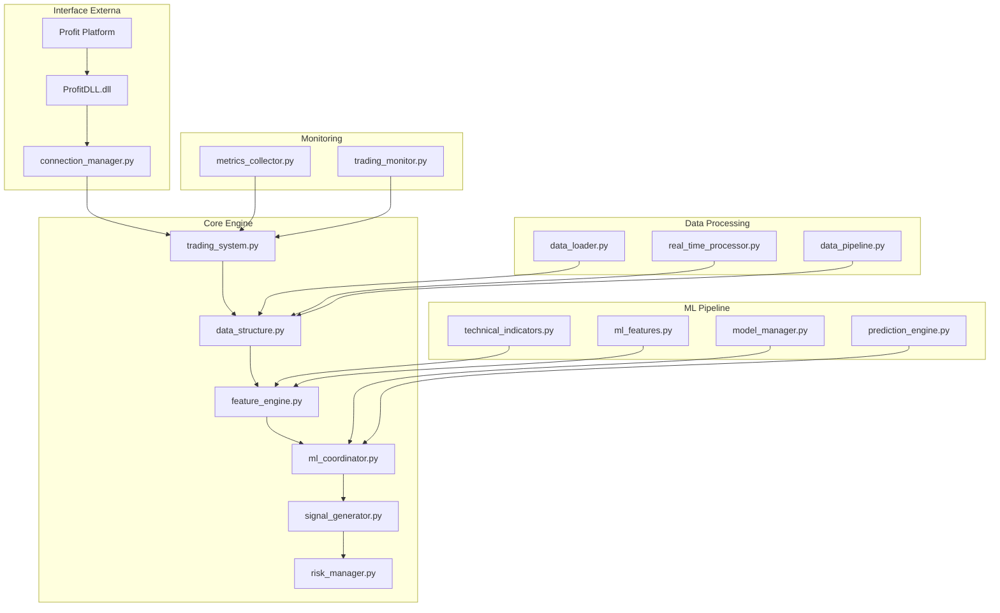

# 🚀 ML Trading v2.0 - Resumo Técnico do Sistema

> **Documento de Referência para Desenvolvedores**  
> Data de Atualização: 2025-07-19  
> Versão: 2.0  

## 📋 Visão Geral

O **ML Trading v2.0** é um sistema avançado de trading algorítmico que utiliza Machine Learning para análise de mercado financeiro em tempo real. O sistema integra-se diretamente com a plataforma **Profit** através de DLL nativa, executa predições baseadas em regimes de mercado e opera automaticamente no mercado de futuros WDO (Mini Índice Bovespa).

### 🎯 Objetivos Principais
- **Trading Autônomo**: Execução automática de operações baseadas em ML
- **Detecção de Regime**: Identificação inteligente de condições de mercado (tendência vs lateralização)
- **Gestão de Risco**: Controle rigoroso de exposição e drawdown
- **Performance**: Processamento em tempo real com baixa latência
- **Escalabilidade**: Arquitetura modular para fácil expansão

---

## 🏗️ Arquitetura do Sistema

### Módulos Principais



---

## 🔧 Componentes Detalhados

### 1. **Sistema Principal** (`trading_system.py`)
- **Função**: Orquestrador principal do sistema
- **Responsabilidades**:
  - Inicialização de todos os componentes
  - Gerenciamento de threads de processamento
  - Loop principal de execução
  - Controle de estado do sistema
- **Threads**:
  - Thread ML: Processamento de predições
  - Thread Signal: Geração de sinais de trading
  - Thread Principal: Monitoramento e controle

### 2. **Gerenciador de Conexão** (`connection_manager.py`)
- **Função**: Interface com a plataforma Profit
- **Responsabilidades**:
  - Carregamento e inicialização da DLL
  - Autenticação e conexão
  - Callbacks para dados de mercado
  - Execução de ordens
- **Estados Monitorados**:
  - Login: Estado de autenticação
  - Roteamento: Estado de conectividade
  - Market Data: Estado de recebimento de dados

### 3. **Gerenciador de Modelos** (`model_manager.py`)
- **Função**: Carregamento e gestão de modelos ML
- **Responsabilidades**:
  - Descoberta automática de features requeridas
  - Carregamento de modelos (XGBoost, LightGBM, Scikit-learn)
  - Cache de metadados
  - Execução de predições individuais e ensemble
- **Modelos Suportados**:
  - `regime_classifier`: Detecção de regime de mercado
  - `trend_model_*`: Modelos para mercado em tendência
  - `range_model_*`: Modelos para mercado lateral

### 4. **Estrutura de Dados** (`data_structure.py`)
- **Função**: Centralização de todos os dados do sistema
- **DataFrames Gerenciados**:
  - `candles`: Dados OHLCV
  - `microstructure`: Dados de microestrutura (buy/sell pressure)
  - `orderbook`: Dados de book de ofertas
  - `indicators`: Indicadores técnicos calculados
  - `features`: Features de ML calculadas
- **Características**:
  - Thread-safe com locks
  - Indexação temporal consistente
  - Validação automática de dados

### 5. **Motor de Features** (`feature_engine.py`)
- **Função**: Coordenação e cálculo de todas as features
- **Pipeline de Features**:
  1. Indicadores técnicos (EMAs, RSI, MACD, etc.)
  2. Features de momentum e volatilidade
  3. Features de microestrutura
  4. Features compostas específicas dos modelos
- **Otimizações**:
  - Cache inteligente para evitar recálculos
  - Processamento paralelo para datasets grandes
  - Sincronização com features dos modelos

### 6. **Coordenador ML** (`ml_coordinator.py`)
- **Função**: Integração entre detecção de regime e predição
- **Fluxo de Execução**:
  1. Detecta regime de mercado (trend/range/undefined)
  2. Seleciona estratégia apropriada
  3. Executa predição específica do regime
  4. Valida confiança e thresholds
- **Validações**:
  - Confiança mínima de 60%
  - Thresholds específicos por regime
  - Verificação de condições de mercado

---

## 📊 Fluxo de Dados e Processamento

### Sequência Principal de Execução

```
1. INICIALIZAÇÃO
   ├── Carregar modelos ML → Descobrir features necessárias
   ├── Conectar com Profit → Autenticar e configurar callbacks
   ├── Inicializar estruturas de dados
   └── Carregar dados históricos (10 dias)

2. PROCESSAMENTO INICIAL
   ├── Calcular indicadores técnicos (45 indicadores)
   ├── Calcular features ML (80+ features)
   ├── Preparar DataFrame modelo (32 features selecionadas)
   └── Iniciar threads de processamento

3. LOOP PRINCIPAL (Tempo Real)
   ├── Receber trades via callback
   ├── Atualizar candles e microestrutura
   ├── Trigger cálculo de features (se necessário)
   ├── Executar predição ML (intervalo configurável)
   ├── Gerar sinal de trading
   ├── Validar risco
   └── Executar ordem (se aprovada)

4. MONITORAMENTO
   ├── Coletar métricas de performance
   ├── Log de atividades
   ├── Monitoramento de saúde do sistema
   └── Relatórios periódicos
```

### Features Calculadas (Total: 80+ features)

#### **Indicadores Técnicos (45 indicadores)**
- **EMAs**: 5, 9, 20, 50, 200 períodos + especiais (fast, med, long)
- **SMAs**: 10, 20, 50 períodos
- **RSI**: 14 períodos + levels (overbought/oversold)
- **MACD**: Line, signal, histogram + crossovers
- **Bollinger Bands**: 10, 20, 50 períodos + position, squeeze
- **Stochastic**: %K, %D, slow versions + levels
- **ATR**: Average True Range + percentage
- **ADX**: Directional strength + +DI/-DI

#### **Features ML (80+ features)**
- **Momentum**: `momentum_1` até `momentum_20`
- **Returns**: `return_5`, `return_10`, `return_20`, `return_50`
- **Volatilidade**: `volatility_5` até `volatility_50`
- **Volume**: `volume_ratio_5` até `volume_ratio_50`
- **High-Low Range**: `high_low_range_5` até `high_low_range_50`
- **Compostas**: `ema_diff`, `ema_diff_fast`, `bb_width`, `range_percent`
- **Microestrutura**: buy_pressure, volume_imbalance, trade_imbalance

---

## 🧠 Sistema de Machine Learning

### Estratégia por Regime

#### **1. Detecção de Regime**
```python
# Condições para classificação
TREND_UP: EMA9 > EMA20 > EMA50 AND ADX > 25
TREND_DOWN: EMA9 < EMA20 < EMA50 AND ADX > 25
RANGE: ADX < 25 AND preço entre suporte/resistência
UNDEFINED: Condições mistas
```

#### **2. Estratégias Específicas**

**Estratégia de Tendência**:
- Risk/Reward: 1:2 (Stop: 5 pontos, Target: 10 pontos)
- Thresholds: Confiança > 60%, Probabilidade > 60%, Direção > 0.7
- Lógica: Operar a favor da tendência estabelecida

**Estratégia de Range**:
- Risk/Reward: 1:1.5 (Stop: ATR-based, mín. 3 pontos)
- Thresholds: Confiança > 60%, Probabilidade > 55%, Direção > 0.5
- Lógica: Reversões em suporte/resistência

### Modelos Implementados

| Modelo | Tipo | Propósito | Features |
|--------|------|-----------|----------|
| `regime_classifier` | XGBoost/LightGBM | Detecção de regime | 32 features |
| `trend_model_gb_conservative` | Gradient Boosting | Predição em tendência | 32 features |
| `trend_model_rf_calibrated` | Random Forest | Predição em tendência | 32 features |
| `range_model_buy` | Ensemble | Sinais de compra em range | 32 features |
| `range_model_sell` | Ensemble | Sinais de venda em range | 32 features |

---

## ⚙️ Configurações do Sistema

### Arquivo .env
```properties
# Conexão Profit
PROFIT_DLL_PATH=C:\Users\...\ProfitDLL.dll
PROFIT_KEY=16168135121806338936
PROFIT_USER=29936354842
PROFIT_PASSWORD=Ultrajiu33!
PROFIT_ACCOUNT_ID=70562000
PROFIT_BROKER_ID=33005
PROFIT_TRADING_PASSWORD=Meri3306!

# Trading
TICKER=WDOQ25
HISTORICAL_DAYS=10
ML_INTERVAL=60
MODELS_DIR=C:\...\models_regime3

# Estratégia
DIRECTION_THRESHOLD=0.6
MAGNITUDE_THRESHOLD=0.002
CONFIDENCE_THRESHOLD=0.6

# Risco
MAX_DAILY_LOSS=0.05
MAX_POSITIONS=1
RISK_PER_TRADE=0.02
```

---

## 🛡️ Gestão de Risco

### Controles Implementados

1. **Limites de Posição**:
   - Máximo 1 posição simultânea
   - Máximo 10 trades por dia
   - Perda máxima diária: 5% do capital

2. **Validações de Entrada**:
   - Regime deve ter confiança > 60%
   - Thresholds específicos por estratégia
   - Horário de operação: 09:00-17:55

3. **Stops e Targets**:
   - Calculados baseados em ATR
   - Risk/Reward mínimo por estratégia
   - Proteção contra gaps

---

## 📈 Métricas e KPIs

### KPIs Monitorados
- **Win Rate**: Taxa de acerto (alvo: >55%)
- **Profit Factor**: Lucro/Perda total (alvo: >1.5)
- **Sharpe Ratio**: Retorno ajustado ao risco (alvo: >1.0)
- **Max Drawdown**: Perda máxima (limite: 10%)
- **Taxa de Sinais**: 3-5 por dia em condições normais

### Métricas Operacionais
- Trades processados
- Predições executadas
- Sinais gerados vs executados
- Latência de processamento
- Estado de conectividade

---

## 🔧 Ambiente de Desenvolvimento

### Estrutura de Arquivos
```
ML_Tradingv2.0/
├── src/                          # Código fonte principal
│   ├── connection_manager.py     # Interface Profit
│   ├── model_manager.py         # Gestão de modelos ML
│   ├── trading_system.py        # Sistema principal
│   ├── data_structure.py        # Centralização de dados
│   ├── feature_engine.py        # Motor de features
│   ├── ml_coordinator.py        # Coordenação ML
│   ├── signal_generator.py      # Geração de sinais
│   ├── risk_manager.py          # Gestão de risco
│   └── models/models_regime3/   # Modelos ML treinados
├── tests/                        # Testes unitários
├── .env                         # Configurações
├── requirements.txt             # Dependências
└── README.md                    # Documentação
```

### Tecnologias Utilizadas
- **Python 3.12+**: Linguagem principal
- **pandas/numpy**: Manipulação de dados
- **scikit-learn**: ML básico
- **XGBoost/LightGBM**: Modelos avançados
- **joblib**: Serialização de modelos
- **python-dotenv**: Configurações
- **threading**: Processamento paralelo
- **ctypes**: Interface com DLL

---

## 🚀 Como Executar

### 1. Pré-requisitos
```bash
# Criar ambiente virtual
python -m venv .venv
.venv\Scripts\activate

# Instalar dependências
pip install -r requirements.txt
```

### 2. Configuração
```bash
# Configurar .env com credenciais do Profit
# Verificar path da DLL e modelos
# Ajustar parâmetros de trading
```

### 3. Execução
```bash
# Executar sistema principal
python src/main.py

# Executar testes
pytest tests/
```

---

## 🔨 Pontos para Upgrade

### 1. **Performance**
- [ ] Implementar processamento GPU para features
- [ ] Otimizar pipeline de dados com Apache Arrow
- [ ] Cache inteligente de predições
- [ ] Compressão de dados históricos

### 2. **ML Avançado**
- [ ] Modelos de Deep Learning (LSTM, Transformer)
- [ ] AutoML para otimização automática
- [ ] Online Learning para adaptação em tempo real
- [ ] Ensemble dinâmico baseado em performance

### 3. **Conectividade**
- [ ] Suporte a múltiplas corretoras
- [ ] API REST para controle remoto
- [ ] WebSocket para dados de mercado
- [ ] Backup e redundância de conexões

### 4. **Monitoramento**
- [ ] Dashboard web em tempo real
- [ ] Alertas via Telegram/WhatsApp
- [ ] Métricas avançadas com Prometheus
- [ ] Logs estruturados com ELK Stack

### 5. **Estratégias**
- [ ] Multi-timeframe analysis
- [ ] Correlação entre ativos
- [ ] Market making strategies
- [ ] Pairs trading

### 6. **Infraestrutura**
- [ ] Containerização com Docker
- [ ] Deployment em cloud (AWS/Azure)
- [ ] CI/CD pipeline
- [ ] Testes automatizados

---

## 📚 Referências Técnicas

### Documentação Interna
- `src/features/complete_ml_data_flow_map.md`: Mapa detalhado do fluxo de dados
- `src/features/ml-prediction-strategy-doc.md`: Estratégias de predição por regime
- `tests/`: Exemplos de uso e testes de componentes

### Logs do Sistema
```bash
# Execução típica bem-sucedida
2025-07-18 19:11:03 - Sistema inicializado com sucesso!
2025-07-18 19:11:04 - ✓ 14401 candles carregadas
2025-07-18 19:11:04 - Indicadores calculados: 45 colunas
2025-07-18 19:11:04 - Features ML calculadas: 14 colunas
2025-07-18 19:11:04 - DataFrame do modelo preparado: (14401, 32)
2025-07-18 19:11:04 - Sistema iniciado e operacional!
```

---

## ⚠️ Considerações Importantes

### Riscos Operacionais
1. **Dependência de DLL**: Sistema depende da ProfitDLL.dll funcional
2. **Conectividade**: Falhas de rede podem impactar operações
3. **Dados**: Qualidade dos dados afeta performance dos modelos
4. **Overfitting**: Modelos podem precisar retreinamento periódico

### Limitações Atuais
1. **Single Asset**: Suporta apenas contratos WDO
2. **Regime Binário**: Apenas trend/range (pode expandir)
3. **Latência**: Processamento sequencial pode ser otimizado
4. **Memoria**: Cache de features pode crescer indefinidamente

### Boas Práticas
1. **Sempre testar** mudanças em ambiente de simulação
2. **Monitorar logs** para identificar anomalias
3. **Backup regular** de modelos e configurações
4. **Validar dados** antes de operações críticas

---

**Status do Sistema**: ✅ **OPERACIONAL**  
**Última Validação**: 2025-07-19  
**Próxima Revisão**: A definir pelo desenvolvedor  

> Este documento serve como guia técnico completo para desenvolvedores que irão trabalhar com melhorias e manutenção do sistema ML Trading v2.0.
