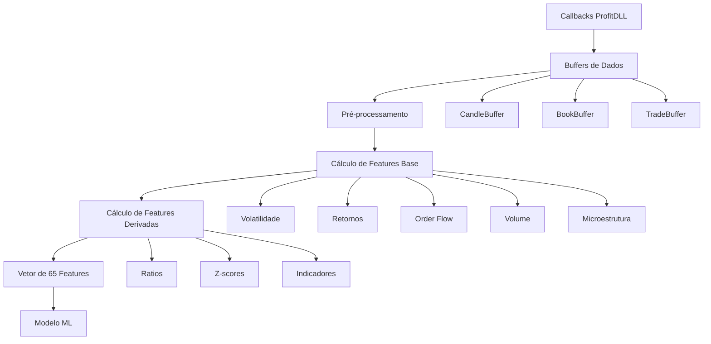

# 📊 Análise de Dependências de Dados

## Visão Geral
Este documento analisa as dependências de dados para calcular as 65 features, identificando quais callbacks são necessários e como os dados devem ser armazenados.

## 🔄 Callbacks Necessários por Feature

### 1. Daily Callback (Candles OHLCV)
**Features dependentes: 30**
```
Volatilidade: volatility_10, volatility_20, volatility_50, volatility_100
Retornos: returns_1, returns_2, returns_5, returns_10, returns_20, returns_50, returns_100
Log Returns: log_returns_1, log_returns_5, log_returns_20
Técnicos: ma_5_20_ratio, ma_20_50_ratio, momentum_5_20, momentum_20_50
Sharpe: sharpe_5, sharpe_20
Volume: volume_ratio_20, volume_ratio_50, volume_ratio_100
Z-scores: volume_zscore_20, volume_zscore_50, volume_zscore_100
Outros: volatility_gk, bb_position
```

### 2. PriceBook Callback (Bid/Ask com volumes)
**Features dependentes: 20**
```
Order Flow: order_flow_imbalance_10, order_flow_imbalance_20, 
           order_flow_imbalance_50, order_flow_imbalance_100
Microestrutura: top_buyer_[0-4]_active, top_seller_[0-4]_active
Contadores: top_buyers_count, top_sellers_count
Mudanças: buyer_changed, seller_changed
```

### 3. Trade/Negócio Callback
**Features dependentes: 8**
```
Volume Assinado: signed_volume, cumulative_signed_volume
Weighted: volume_weighted_return
Intensidade: trade_intensity, trade_intensity_ratio
Agressão: is_buyer_aggressor, is_seller_aggressor
Turnover: agent_turnover
```

### 4. Sistema/Relógio
**Features dependentes: 6**
```
Temporais: minute, hour, day_of_week
Períodos: is_opening_30min, is_closing_30min, is_lunch_hour
Normalização: time_normalized
```

### 5. Calculadas (Derivadas)
**Features dependentes: 8**
```
Ratios: volatility_ratio_10, volatility_ratio_20, 
        volatility_ratio_50, volatility_ratio_100
```

## 📦 Estrutura de Buffers Necessária

### Buffer de Candles
```python
class CandleBuffer:
    max_size = 200  # Para calcular volatility_100 e returns_100
    
    fields = {
        'timestamp': datetime,
        'open': float,
        'high': float,
        'low': float,
        'close': float,
        'volume': float
    }
    
    # Métodos necessários
    def add_candle(self, candle_data)
    def get_last_n(self, n)
    def calculate_returns(self, periods)
    def calculate_volatility(self, periods)
```

### Buffer de Book
```python
class BookBuffer:
    max_size = 100  # Para order flow de 100 períodos
    
    fields = {
        'timestamp': datetime,
        'bid_price': [float] * 5,  # 5 níveis
        'bid_volume': [float] * 5,
        'ask_price': [float] * 5,
        'ask_volume': [float] * 5,
        'bid_traders': [str] * 5,  # IDs dos traders
        'ask_traders': [str] * 5
    }
    
    # Métodos necessários
    def add_snapshot(self, book_data)
    def calculate_imbalance(self, periods)
    def get_top_traders(self)
    def detect_changes(self)
```

### Buffer de Trades
```python
class TradeBuffer:
    max_size = 1000  # Para análise de microestrutura
    
    fields = {
        'timestamp': datetime,
        'price': float,
        'volume': float,
        'side': str,  # 'buy' ou 'sell'
        'aggressor': str,  # 'buyer' ou 'seller'
        'trader_id': str
    }
    
    # Métodos necessários
    def add_trade(self, trade_data)
    def calculate_signed_volume(self, periods)
    def calculate_intensity(self, time_window)
    def get_unique_traders(self, time_window)
```

## 🔄 Fluxo de Processamento



## 📊 Matriz de Dependências

| Categoria | Daily | PriceBook | Trade | Sistema | Derivada |
|-----------|-------|-----------|-------|---------|----------|
| Volatilidade | ✅ | ❌ | ❌ | ❌ | ✅ |
| Retornos | ✅ | ❌ | ❌ | ❌ | ❌ |
| Order Flow | ❌ | ✅ | ✅ | ❌ | ❌ |
| Volume | ✅ | ❌ | ✅ | ❌ | ❌ |
| Microestrutura | ❌ | ✅ | ✅ | ❌ | ❌ |
| Temporais | ❌ | ❌ | ❌ | ✅ | ❌ |
| Técnicos | ✅ | ❌ | ❌ | ❌ | ✅ |

## 🎯 Requisitos de Armazenamento

### Memória RAM Estimada
```
Candles: 200 * 6 fields * 8 bytes = ~10 KB
Book: 100 * 20 fields * 8 bytes = ~16 KB
Trades: 1000 * 6 fields * 8 bytes = ~48 KB
Total por símbolo: ~74 KB

Com overhead e estruturas: ~200 KB por símbolo
```

### Tempo de Retenção
```
Candles: Mínimo 200 períodos (3.3 horas em timeframe 1min)
Book: Mínimo 100 snapshots (1.6 minutos com snapshot/segundo)
Trades: Mínimo 1000 trades (variável, ~10-30 minutos)
```

## 🔧 Implementação Sugerida

### Fase 1: Callbacks Essenciais
1. Implementar recepção de Daily Callback
2. Implementar recepção de PriceBook Callback
3. Criar buffers básicos

### Fase 2: Features Básicas
1. Calcular volatilidades e retornos (30 features)
2. Calcular features temporais (6 features)
3. Total: 36 features funcionando

### Fase 3: Features Avançadas
1. Implementar Trade Callback
2. Calcular order flow (8 features)
3. Calcular microestrutura (15 features)
4. Total: 59 features funcionando

### Fase 4: Features Complexas
1. Calcular indicadores técnicos (6 features restantes)
2. Validação e otimização
3. Total: 65 features completas

## ⚠️ Pontos Críticos

### Sincronização
- Todos os buffers devem estar sincronizados temporalmente
- Usar timestamps como chave de sincronização
- Implementar interpolação para dados faltantes

### Performance
- Cálculos incrementais sempre que possível
- Cache de valores que não mudam frequentemente
- Vectorização com NumPy para operações em batch

### Robustez
- Tratamento de NaN e valores extremos
- Validação de ranges esperados
- Logs detalhados de anomalias

---

*Documento criado: 08/08/2025*