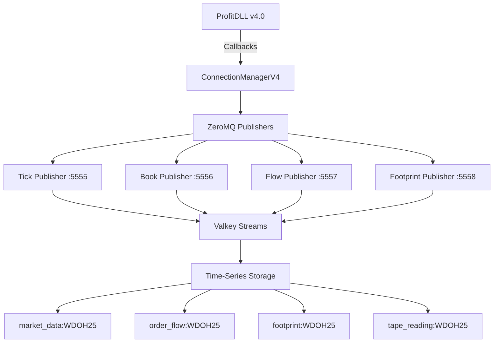
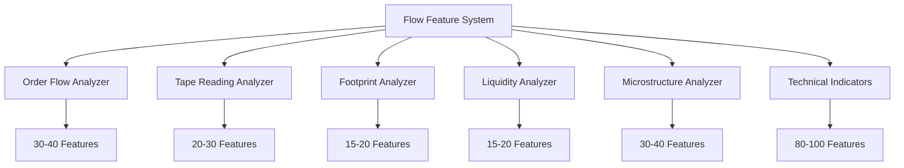
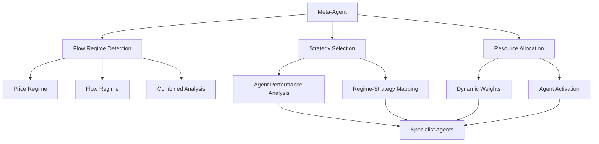
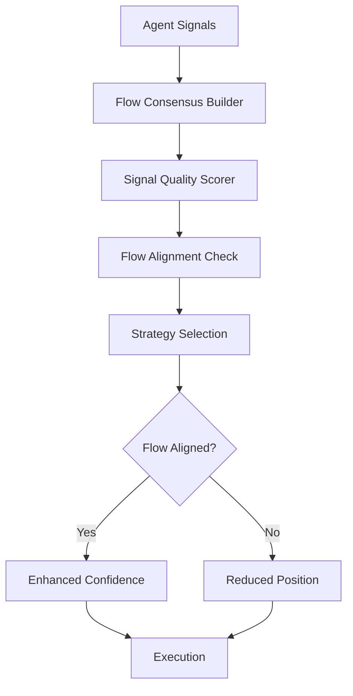
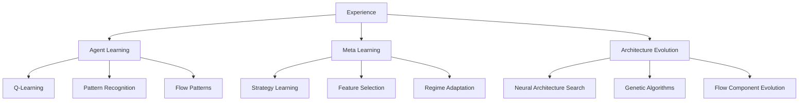
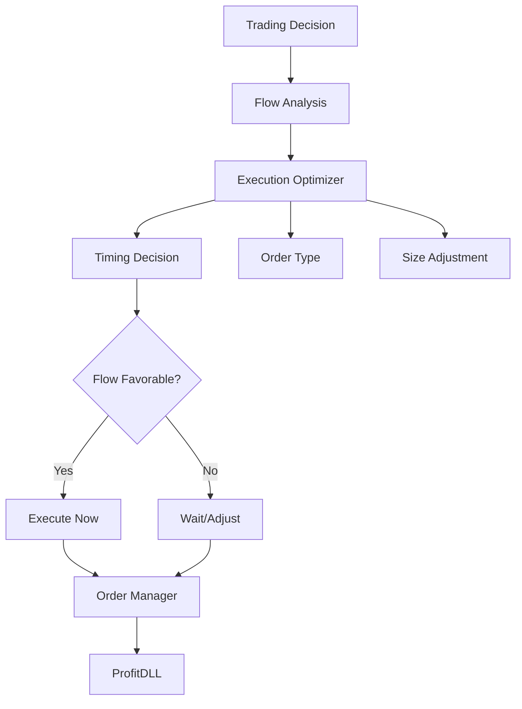
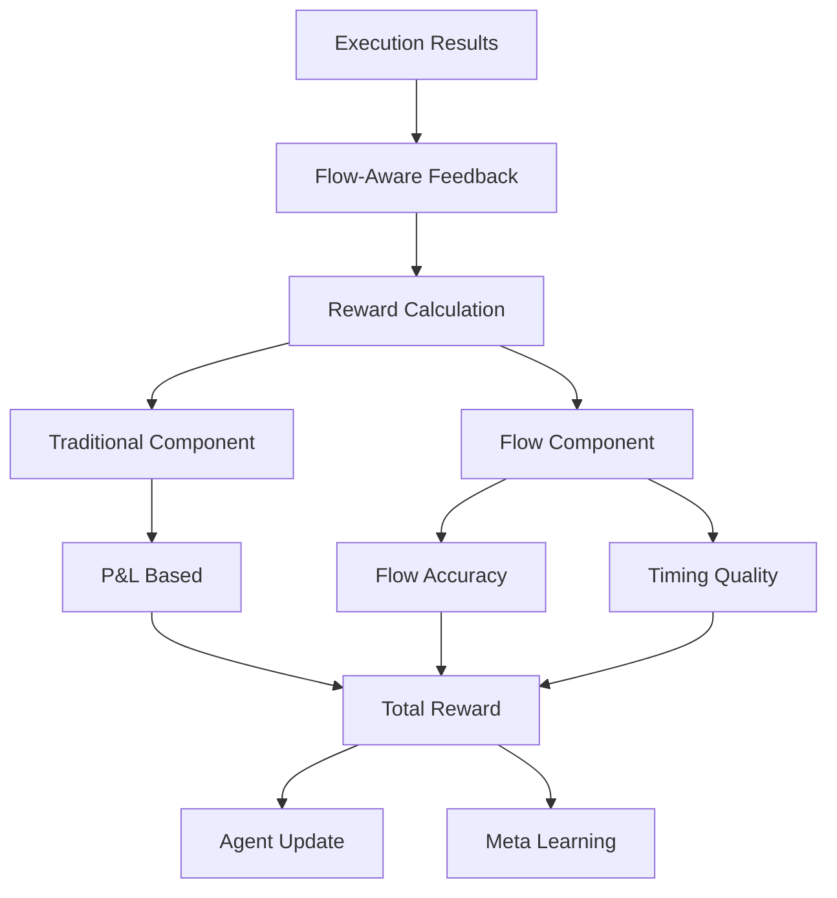

# MAPA DE FLUXO HMARL COM ANÁLISE DE FLUXO AVANÇADA

## 🏗️ Visão Geral da Nova Arquitetura HMARL

```
┌─────────────────────────────────────────────────────────────┐
│                      META-AGENT LAYER                       │
│    (Flow-Aware Meta-Agent + Regime Detection + Evolution)  │
└─────────────────────────┬───────────────────────────────────┘
                          │
┌─────────────────────────┴───────────────────────────────────┐
│                   COORDINATION LAYER                         │
│      (Flow-Aware Coordinator + Consensus Builder)           │
└─────────────────────────┬───────────────────────────────────┘
                          │
┌─────────────────────────┴───────────────────────────────────┐
│                    SPECIALIST AGENTS                         │
│  ┌────────┐ ┌────────┐ ┌────────┐ ┌────────┐ ┌────────┐   │
│  │Order   │ │Foot-   │ │Tape    │ │Trend   │ │Mean    │   │
│  │Flow    │ │print   │ │Reading │ │Follow  │ │Revert  │   │
│  └────────┘ └────────┘ └────────┘ └────────┘ └────────┘   │
└─────────────────────────┬───────────────────────────────────┘
                          │
┌─────────────────────────┴───────────────────────────────────┐
│                   EXECUTION AGENTS                           │
│    (Position Sizing + Market Timing + Order Routing)        │
└─────────────────────────┬───────────────────────────────────┘
                          │
┌─────────────────────────┴───────────────────────────────────┐
│                 INFRASTRUCTURE LAYER                         │
│         ZeroMQ + Valkey + ProfitDLL Integration            │
└─────────────────────────────────────────────────────────────┘
```

## 📊 Fluxo Detalhado de Dados com HMARL

### 1. CAMADA DE DADOS (ZeroMQ + Valkey Enhanced)



**Streams de Dados Expandidos:**
```
Valkey Streams Structure
├── market_data:WDOH25 (100k entries)
│   └── price, volume, timestamp
├── order_flow:WDOH25 (100k entries)
│   └── buy_volume, sell_volume, imbalance, delta
├── footprint:WDOH25 (100k entries)
│   └── price_levels, volume_at_price, patterns
├── tape_reading:WDOH25 (100k entries)
│   └── trade_size, aggressor, speed, patterns
├── liquidity_profile:WDOH25 (50k entries)
│   └── bid_depth, ask_depth, liquidity_score
├── agent_decisions:all (10k entries)
│   └── agent_id, action, confidence, metadata
├── agent_performance:all (10k entries)
│   └── agent_id, reward, accuracy, metrics
└── meta_decisions:global (1k entries)
    └── regime, allocation, strategies
```

### 2. CAMADA DE FEATURES (~250 Features Total)



**Feature Categories:**
```python
Flow Features Structure
├── Order Flow Features (30-40)
│   ├── OFI (1m, 5m, 15m, 30m, 60m)
│   ├── Delta (cumulative, divergence, momentum)
│   ├── Aggression (buy, sell, ratio)
│   └── Volume Profile (POC, value area, skew)
├── Tape Reading Features (20-30)
│   ├── Trade Size Distribution
│   ├── Speed of Tape
│   ├── Large Trade Detection
│   └── Pattern Recognition
├── Footprint Features (15-20)
│   ├── Absorption Patterns
│   ├── Imbalance Patterns
│   ├── Reversal Patterns
│   └── Continuation Patterns
├── Liquidity Features (15-20)
│   ├── Depth Analysis
│   ├── Liquidity Imbalance
│   ├── Hidden Liquidity
│   └── Liquidity Consumption
├── Microstructure Features (30-40)
│   ├── Spread Analysis
│   ├── Price Impact
│   ├── Tick Analysis
│   └── High Frequency Patterns
└── Technical Features (80-100)
    ├── Price Action
    ├── Momentum
    ├── Volatility
    └── Traditional Indicators
```

### 3. HIERARQUIA DE AGENTES HMARL



**Agent Communication Flow:**
```
Meta-Agent (10s cycle)
    ↓ (Meta Decisions)
Coordinator (1s cycle)
    ↓ (Coordination)
Specialist Agents (100ms cycle)
    ↓ (Signals)
Execution Agents (10ms cycle)
    ↓ (Orders)
ProfitDLL
```

### 4. PROCESSAMENTO DE SINAIS COM FLOW



**Signal Processing Pipeline:**
```python
Signal Flow
├── Collection Phase (10ms)
│   ├── Gather all agent signals
│   ├── Extract flow components
│   └── Build consensus
├── Scoring Phase (20ms)
│   ├── Quality assessment
│   ├── Flow alignment
│   └── Risk evaluation
├── Coordination Phase (30ms)
│   ├── Strategy selection
│   ├── Position sizing
│   └── Timing optimization
└── Execution Phase (40ms)
    ├── Order creation
    ├── Smart routing
    └── Execution monitoring
```

### 5. SISTEMA DE LEARNING MULTINÍVEL



**Learning Cycles:**
```
Real-time Learning
├── Agent Level (100ms - 1s)
│   ├── Experience collection
│   ├── Pattern matching
│   └── Parameter adjustment
├── Coordination Level (1s - 1min)
│   ├── Performance tracking
│   ├── Weight adjustment
│   └── Strategy optimization
├── Meta Level (1min - 1hr)
│   ├── Regime learning
│   ├── Feature importance
│   └── Strategy selection
└── Evolution Level (1hr - 1day)
    ├── Architecture search
    ├── Component evolution
    └── System optimization
```

### 6. EXECUÇÃO INTELIGENTE COM FLOW



**Execution Flow:**
```python
Execution Pipeline
├── Pre-Execution (50ms)
│   ├── Flow state analysis
│   ├── Liquidity check
│   ├── Impact estimation
│   └── Timing optimization
├── Order Creation (20ms)
│   ├── Type selection
│   ├── Price determination
│   ├── Size calculation
│   └── Parameter setting
├── Smart Routing (30ms)
│   ├── Algorithm selection
│   ├── Slice planning
│   ├── Route optimization
│   └── Fallback strategy
└── Post-Execution (100ms)
    ├── Fill analysis
    ├── Slippage calculation
    ├── Performance attribution
    └── Learning update
```

### 7. FEEDBACK E MONITORAMENTO



**Feedback Loop:**
```
Feedback System
├── Immediate (< 100ms)
│   ├── Execution confirmation
│   ├── Slippage measurement
│   └── Initial reward
├── Short-term (1-5min)
│   ├── Position performance
│   ├── Flow confirmation
│   └── Pattern validation
├── Medium-term (5-60min)
│   ├── Strategy performance
│   ├── Agent comparison
│   └── Learning insights
└── Long-term (1hr+)
    ├── Regime performance
    ├── System optimization
    └── Evolution triggers
```

## 🔄 Ciclo Completo HMARL

```
T0: System Initialization
├── Load existing models (compatibility)
├── Initialize HMARL agents
├── Setup ZeroMQ + Valkey
└── Connect ProfitDLL

T1: Historical Data Load
├── Request via ProfitDLL
├── Stream to Valkey
├── Calculate initial features
└── Warm up agents

T2: Real-time Operation
├── Market Data → ZeroMQ → Valkey
├── Feature Calculation (5s)
├── Agent Processing (100ms)
├── Coordination (1s)
├── Meta Decisions (10s)
└── Execution (<100ms)

T3: Continuous Learning
├── Experience Collection
├── Online Learning
├── Meta-Learning (hourly)
└── Architecture Evolution (daily)
```

## 📈 Métricas de Performance Esperadas

### Latência
- **Feature Calculation**: < 500ms (com cache)
- **Agent Decision**: < 100ms
- **Coordination**: < 200ms
- **Total Pipeline**: < 1 segundo

### Capacidade
- **Throughput**: 10,000+ decisões/minuto
- **Concurrent Agents**: 20-50
- **Data Points**: 1M+ por dia
- **Memory Usage**: 4-8GB

### Performance de Trading
- **Win Rate**: 65-75%
- **Sharpe Ratio**: 2.0-3.0
- **Max Drawdown**: < 10%
- **Recovery Time**: < 2 horas

## 🛡️ Compatibilidade com Sistema Atual

### Mantidos
1. **ProfitDLL Integration**: ConnectionManagerV4 inalterado
2. **Data Structure**: TradingDataStructure expandida
3. **Risk Manager**: Aprimorado mas compatível
4. **Order Manager**: Interface mantida

### Adicionados
1. **ZeroMQ Layer**: Transparente ao sistema atual
2. **Valkey Storage**: Paralelo ao storage atual
3. **HMARL Agents**: Adicionais aos modelos ML
4. **Flow Analysis**: Complementar aos indicadores

### Migração Gradual
```
Phase 1: Add ZeroMQ + Valkey (não quebra nada)
Phase 2: Add Flow Features (features adicionais)
Phase 3: Add HMARL Agents (paralelo ao ML atual)
Phase 4: Enable Learning (melhoria contínua)
Phase 5: Enable Evolution (otimização automática)
```

## 🔧 Configuração Recomendada

```python
HMARL_CONFIG = {
    # Compatibilidade
    'dll_path': './ProfitDLL64.dll',
    'models_dir': './models/',
    'use_legacy_ml': True,  # Manter ML atual
    
    # ZeroMQ
    'zmq': {
        'tick_port': 5555,
        'book_port': 5556,
        'flow_port': 5557,
        'footprint_port': 5558
    },
    
    # Valkey
    'valkey': {
        'host': 'localhost',
        'port': 6379,
        'stream_maxlen': 100000,
        'ttl_days': 30
    },
    
    # HMARL
    'agents': {
        'max_agents': 20,
        'specialist_types': [
            'order_flow', 'footprint', 'tape_reading',
            'trend_following', 'mean_reversion'
        ],
        'execution_types': [
            'position_sizing', 'market_timing', 'smart_routing'
        ]
    },
    
    # Learning
    'learning': {
        'online_update_freq': 100,  # trades
        'meta_update_freq': 3600,   # segundos
        'evolution_freq': 86400     # segundos
    },
    
    # Flow Analysis
    'flow': {
        'ofi_windows': [1, 5, 15, 30, 60],
        'min_confidence': 0.3,
        'flow_weight': 0.4
    }
}
```

## 📝 Notas de Implementação

1. **Backward Compatibility**: Sistema atual continua funcionando
2. **Gradual Enhancement**: Features adicionadas incrementalmente
3. **Fail-Safe**: Fallback para sistema atual se HMARL falhar
4. **Performance First**: Cache agressivo para features
5. **Flow Priority**: Análise de fluxo tem prioridade em decisões

---

*Versão: HMARL v1.0 - Compatible with QuantumTrader_ML v2.0*
*Data: Agosto 2025*