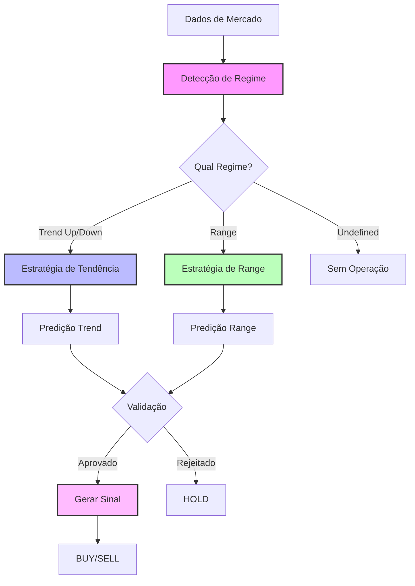

# Sistema de Predição ML e Estratégia de Trading

## 📊 Visão Geral

O sistema utiliza Machine Learning para detectar regimes de mercado e gerar sinais de trading específicos para cada condição. A abordagem é baseada em duas etapas principais:

1. **Detecção de Regime**: Classifica o mercado em tendência (trend) ou lateralização (range)
2. **Predição Específica**: Aplica estratégias diferentes para cada regime

## 🔄 Fluxo de Predição



## 📈 Regimes de Mercado

### 1. Tendência (Trend)

**Características:**
- Movimento direcional claro
- Médias móveis alinhadas
- Momentum consistente

**Subtipos:**
- `trend_up`: Tendência de alta
- `trend_down`: Tendência de baixa

**Indicadores de Detecção:**
- EMA 9 > EMA 20 > EMA 50 (alta)
- EMA 9 < EMA 20 < EMA 50 (baixa)
- ADX > 25
- Preço consistentemente acima/abaixo das médias

### 2. Lateralização (Range)

**Características:**
- Movimento horizontal
- Preço oscila entre suporte e resistência
- Baixo momentum direcional

**Indicadores de Detecção:**
- Preço próximo às Bandas de Bollinger
- RSI entre 30-70
- ADX < 25
- Suporte e resistência bem definidos

## 🎯 Estratégias por Regime

### Estratégia de Tendência

**Filosofia**: Operar a favor da tendência estabelecida

**Critérios de Entrada:**
- ✅ Regime confirmado como `trend_up` ou `trend_down`
- ✅ Confiança no regime > 60%
- ✅ Probabilidade do modelo > 60%
- ✅ Direção da predição alinhada com a tendência
- ✅ Magnitude esperada > 5 pontos WDO

**Parâmetros de Risco:**
- Stop Loss: 5 pontos (fixo)
- Take Profit: 10 pontos (fixo)
- Risk/Reward: 1:2

**Exemplo - Tendência de Alta:**
```
Regime: trend_up (confiança: 85%)
Preço Atual: 5000
Predição: BUY (probabilidade: 75%)
Entry: 5000
Stop Loss: 4995 (-5 pontos)
Take Profit: 5010 (+10 pontos)
R:R = 1:2
```

### Estratégia de Range

**Filosofia**: Operar reversões nos extremos do range

**Critérios de Entrada:**
- ✅ Regime confirmado como `range`
- ✅ Confiança no regime > 60%
- ✅ Proximidade de níveis-chave:
  - Near Support → BUY
  - Near Resistance → SELL
- ✅ Probabilidade do modelo > 55%
- ✅ Magnitude esperada > 3 pontos WDO

**Parâmetros de Risco:**
- Stop Loss: Baseado em ATR (mín. 3 pontos)
- Take Profit: Stop × 1.5
- Risk/Reward: 1:1.5

**Exemplo - Compra no Suporte:**
```
Regime: range (confiança: 80%)
Preço Atual: 4980
Suporte: 4975
Resistência: 5025
Proximidade: near_support
Predição: BUY (probabilidade: 65%)
Entry: 4980
Stop Loss: 4974 (-6 pontos)
Take Profit: 4989 (+9 pontos)
R:R = 1:1.5
```

## 🚦 Validações e Filtros

### Thresholds Mínimos

| Parâmetro | Tendência | Range |
|-----------|-----------|--------|
| Confiança Regime | 60% | 60% |
| Probabilidade Modelo | 60% | 55% |
| Direção (abs) | 0.7 | 0.5 |
| Magnitude | 0.003 | 0.0015 |
| Confiança Predição | 25% | 30% |

### Condições de Rejeição (HOLD)

1. **Regime Indefinido**
   - Confiança no regime < 60%
   - Regime classificado como "undefined"

2. **Sinal Fraco**
   - Direção < threshold mínimo
   - Magnitude insuficiente
   - Confiança baixa

3. **Range - Posição Neutra**
   - Preço no meio do range
   - Longe de suporte/resistência

4. **Trend - Contra-tendência**
   - Sinal contrário à direção da tendência
   - Divergência entre modelos

## 📊 Processo de Decisão

### 1. Análise de Regime
```python
regime_info = analyze_market(data)
# Retorna:
# {
#   'regime': 'trend_up',
#   'confidence': 0.85,
#   'trend_strength': 0.7,
#   'support_level': 4950,
#   'resistance_level': 5050
# }
```

### 2. Cálculo de Features
```python
features = calculate_features(data)
# Inclui:
# - Indicadores técnicos (EMAs, RSI, MACD, etc)
# - Features de momentum
# - Features de volatilidade
# - Features de microestrutura
```

### 3. Predição ML
```python
prediction = predict_by_regime(features, regime_info)
# Retorna:
# {
#   'direction': 0.8,      # -1 a 1
#   'magnitude': 0.003,    # movimento esperado
#   'confidence': 0.75,    # 0 a 1
#   'can_trade': True,
#   'regime': 'trend_up'
# }
```

### 4. Geração de Sinal
```python
signal = generate_signal(prediction, market_data)
# Retorna:
# {
#   'action': 'BUY',
#   'entry_price': 5000,
#   'stop_loss': 4995,
#   'take_profit': 5010,
#   'risk_reward': 2.0,
#   'confidence': 0.75
# }
```

## 📈 Exemplos Práticos

### Caso 1: Tendência de Alta Clara

**Contexto:**
- EMA9: 5010, EMA20: 5005, EMA50: 4995
- RSI: 65
- Preço: 5015
- Volume crescente

**Análise:**
1. Regime detectado: `trend_up` (90% confiança)
2. Modelos preveem continuação (80% prob)
3. Sinal: **BUY**
4. Entry: 5015, SL: 5010, TP: 5025

### Caso 2: Range com Teste de Suporte

**Contexto:**
- Preço oscilando entre 4950-5050 há 2 dias
- Preço atual: 4955 (próximo ao suporte)
- RSI: 35 (oversold)
- Volume normal

**Análise:**
1. Regime detectado: `range` (85% confiança)
2. Proximidade: `near_support`
3. Modelos preveem reversão (65% prob)
4. Sinal: **BUY**
5. Entry: 4955, SL: 4949, TP: 4958

### Caso 3: Mercado Indefinido

**Contexto:**
- EMAs desalinhadas
- Volatilidade alta
- Sem padrão claro

**Análise:**
1. Regime: `undefined` (40% confiança)
2. Decisão: **HOLD**
3. Aguardar condições mais claras

## 🛡️ Gerenciamento de Risco

### Limites por Sessão
- Máximo de posições simultâneas: 1
- Perda máxima diária: 5% do capital
- Trades máximos por dia: 10

### Trailing Stop (Tendência)
- Ativação: +10 pontos de lucro
- Stop move para breakeven + 2 pontos
- Acompanha movimento a cada 5 pontos extras

### Horário de Operação
- WDO: 09:00 às 17:55
- Evitar primeira e última hora
- Sem operações em feriados

## 📊 Métricas de Performance

### KPIs Principais
- **Win Rate**: Taxa de acerto (alvo: >55%)
- **Profit Factor**: Lucro total / Perda total (alvo: >1.5)
- **Sharpe Ratio**: Retorno ajustado ao risco (alvo: >1.0)
- **Max Drawdown**: Perda máxima da carteira (limite: 10%)

### Estatísticas por Regime
- **Tendência**: Win rate esperado 60-65%
- **Range**: Win rate esperado 55-60%
- **Taxa de sinais**: 3-5 por dia em condições normais

## 🔧 Parâmetros Ajustáveis

### Configuração Conservadora
```python
config = {
    'direction_threshold': 0.5,      # Mais seletivo
    'magnitude_threshold': 0.002,    # Movimento maior
    'confidence_threshold': 0.7,     # Mais confiança
    'max_positions': 1,
    'risk_per_trade': 0.01          # 1% de risco
}
```

### Configuração Agressiva
```python
config = {
    'direction_threshold': 0.3,      # Menos seletivo
    'magnitude_threshold': 0.001,    # Movimento menor
    'confidence_threshold': 0.5,     # Menos confiança
    'max_positions': 2,
    'risk_per_trade': 0.02          # 2% de risco
}
```

## 🚀 Roadmap de Melhorias

1. **Curto Prazo**
   - Adicionar filtro de volatilidade
   - Implementar gestão de capital dinâmica
   - Melhorar detecção de suporte/resistência

2. **Médio Prazo**
   - Machine Learning para ajuste dinâmico de stops
   - Análise de correlação entre ativos
   - Sistema de alertas e notificações

3. **Longo Prazo**
   - Deep Learning para padrões complexos
   - Integração com análise fundamentalista
   - Sistema multi-timeframe

## 📝 Notas Importantes

1. **Backtesting**: Sempre validar mudanças com dados históricos
2. **Paper Trading**: Testar em ambiente simulado antes de produção
3. **Monitoramento**: Acompanhar métricas diariamente
4. **Ajustes**: Revisar parâmetros mensalmente baseado em performance

---

*Este documento é parte do Sistema de Trading ML v2.0*