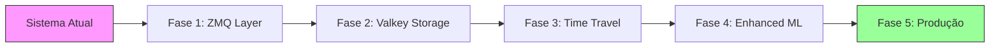

# 📋 Fases de Implementação ZMQ + Valkey - Zero Breaking Changes

## 🎯 Princípios de Implementação

1. **Compatibilidade Total**: Sistema atual continua funcionando sem modificações
2. **Opt-in Features**: Novas funcionalidades são opcionais via configuração
3. **Fallback Automático**: Se novo sistema falhar, usa sistema original
4. **Teste Incremental**: Cada fase é testável independentemente

## 📊 Visão Geral das Fases



## 🚀 FASE 1: Camada ZMQ (2-3 dias)

### Objetivo
Adicionar publicação ZMQ sem afetar fluxo de dados atual

### Implementação
```python
# 1. Criar wrapper não-invasivo
class ZMQPublisherWrapper:
    def __init__(self, connection_manager):
        self.original = connection_manager
        self._intercept_callbacks()
    
    def _intercept_callbacks(self):
        # Preserva callback original
        original_callback = self.original.callback
        
        # Adiciona publicação ZMQ
        def enhanced_callback(*args):
            result = original_callback(*args)  # Original continua
            self._publish_zmq(args)  # Adiciona ZMQ
            return result

# 2. Ativar apenas se configurado
if config.get('zmq_enabled', False):
    zmq_wrapper = ZMQPublisherWrapper(connection_manager)
```

### Validação
- [ ] Sistema original funciona sem ZMQ
- [ ] Com ZMQ habilitado, dados são publicados
- [ ] Performance não degradada (< 1ms overhead)

### Rollback
```bash
# Desabilitar ZMQ instantaneamente
export ZMQ_ENABLED=false
# Sistema volta ao comportamento original
```

## 📦 FASE 2: Storage Valkey (2-3 dias)

### Objetivo
Armazenar dados em Valkey para histórico e backup

### Implementação
```python
# 1. Bridge ZMQ → Valkey (processo separado)
class ZMQValkeyBridge:
    def run(self):
        # Consome ZMQ e armazena em Valkey
        # Não afeta sistema principal
        
# 2. Iniciar como serviço opcional
if config.get('valkey_enabled', False):
    bridge = ZMQValkeyBridge()
    bridge_thread = Thread(target=bridge.run)
    bridge_thread.start()
```

### Validação
- [ ] Dados fluem para Valkey sem afetar sistema
- [ ] Queries time travel funcionam
- [ ] Sistema continua se Valkey cair

### Rollback
```bash
# Parar bridge sem afetar sistema
docker stop ml-trading-valkey
# Sistema continua funcionando normalmente
```

## 🕐 FASE 3: Time Travel Features (3-4 dias)

### Objetivo
Adicionar features avançadas usando dados históricos

### Implementação
```python
# 1. Feature Engine com fallback
class EnhancedFeatureEngine:
    def calculate_features(self, data):
        # Tenta usar time travel
        if self.time_travel_available():
            return self._enhanced_calculation(data)
        else:
            # Fallback para cálculo original
            return self.original_engine.calculate_features(data)

# 2. Ativação gradual
if config.get('time_travel_enabled', False):
    feature_engine = EnhancedFeatureEngine(original_engine)
else:
    feature_engine = original_engine  # Usa original
```

### Validação
- [ ] Features enhanced quando Valkey disponível
- [ ] Fallback automático se Valkey indisponível
- [ ] Mesma interface, sem quebrar dependências

### Rollback
```python
# Desabilitar time travel mantendo Valkey
TIME_TRAVEL_ENABLED=false
# Volta a usar cálculo original de features
```

## 🤖 FASE 4: ML Enhancement (2-3 dias)

### Objetivo
Melhorar predições com features de time travel

### Implementação
```python
# 1. ML Coordinator com modo híbrido
class HybridMLCoordinator:
    def predict(self, features):
        # Modo 1: Fast (sistema original)
        if self._should_use_fast_mode():
            return self.original_coordinator.predict(features)
        
        # Modo 2: Enhanced (com time travel)
        if self.time_travel_features:
            enhanced_features = self._merge_features(
                features, 
                self.time_travel_features
            )
            return self.enhanced_predict(enhanced_features)
        
        # Fallback
        return self.original_coordinator.predict(features)
```

### Validação
- [ ] Predições melhoradas com time travel
- [ ] Performance aceitável (< 2s total)
- [ ] Fallback automático em horário crítico

### Rollback
```python
# Forçar modo fast sempre
FORCE_FAST_MODE=true
# Sistema usa apenas lógica original
```

## 🏭 FASE 5: Deploy Produção (3-5 dias)

### Objetivo
Ativar sistema completo em produção com segurança

### Implementação Gradual

#### Semana 1: Shadow Mode
```python
# Sistema publica para ZMQ mas não consome
config = {
    'zmq_enabled': True,      # Publica dados
    'zmq_consume': False,     # Não consome
    'valkey_enabled': True,   # Armazena dados
    'time_travel': False      # Não usa ainda
}
```

#### Semana 2: Partial Features
```python
# Ativa time travel para 10% das operações
config = {
    'zmq_enabled': True,
    'valkey_enabled': True,
    'time_travel': True,
    'time_travel_percentage': 0.1  # 10%
}
```

#### Semana 3: Full Features
```python
# Sistema completo com fallbacks
config = {
    'zmq_enabled': True,
    'valkey_enabled': True,  
    'time_travel': True,
    'enhanced_ml': True,
    'fallback_on_error': True  # Segurança
}
```

### Validação Final
- [ ] Métricas de trading mantidas ou melhoradas
- [ ] Latência dentro do aceitável
- [ ] Zero downtime durante deploy
- [ ] Rollback testado e funcional

### Plano de Rollback Completo
```bash
# Nível 1: Desabilitar enhanced features
export ENHANCED_ML=false
export TIME_TRAVEL=false

# Nível 2: Desabilitar Valkey
export VALKEY_ENABLED=false

# Nível 3: Desabilitar ZMQ
export ZMQ_ENABLED=false

# Sistema volta 100% ao original
```

## 📊 Matriz de Riscos e Mitigação

| Fase | Risco | Impacto | Mitigação |
|------|-------|---------|-----------|
| ZMQ | Overhead latência | Baixo | Publicação assíncrona |
| Valkey | Memória/Storage | Médio | Limites e TTL configurados |
| Time Travel | Performance queries | Médio | Cache e índices otimizados |
| Enhanced ML | Latência predição | Alto | Modo fast em horário crítico |
| Produção | Falha sistêmica | Crítico | Múltiplos níveis de fallback |

## 🔧 Configuração por Ambiente

### Desenvolvimento
```env
ZMQ_ENABLED=true
VALKEY_ENABLED=true
TIME_TRAVEL_ENABLED=true
ENHANCED_ML_ENABLED=true
FALLBACK_ON_ERROR=true
LOG_LEVEL=DEBUG
```

### Homologação
```env
ZMQ_ENABLED=true
VALKEY_ENABLED=true
TIME_TRAVEL_ENABLED=true
TIME_TRAVEL_PERCENTAGE=0.5
ENHANCED_ML_ENABLED=false
FALLBACK_ON_ERROR=true
LOG_LEVEL=INFO
```

### Produção
```env
ZMQ_ENABLED=true
VALKEY_ENABLED=true
TIME_TRAVEL_ENABLED=true
TIME_TRAVEL_PERCENTAGE=1.0
ENHANCED_ML_ENABLED=true
FALLBACK_ON_ERROR=true
LOG_LEVEL=WARNING
ALERT_ON_FALLBACK=true
```

## 📈 Métricas de Acompanhamento

### Dashboard de Migração
```python
class MigrationMetrics:
    def __init__(self):
        self.metrics = {
            'original_calls': 0,
            'enhanced_calls': 0,
            'fallback_count': 0,
            'zmq_published': 0,
            'valkey_stored': 0,
            'time_travel_queries': 0,
            'average_latency_ms': 0
        }
    
    def report(self):
        # Gera relatório de uso dos sistemas
        enhanced_percentage = (
            self.metrics['enhanced_calls'] / 
            (self.metrics['original_calls'] + self.metrics['enhanced_calls'])
        ) * 100
        
        return {
            'migration_progress': f"{enhanced_percentage:.1f}%",
            'fallback_rate': self.metrics['fallback_count'],
            'performance': f"{self.metrics['average_latency_ms']:.1f}ms"
        }
```

## ✅ Checklist de Implementação

### Pré-requisitos
- [ ] Ambiente de dev configurado
- [ ] Valkey instalado e testado
- [ ] Testes do sistema atual passando
- [ ] Backup do sistema atual

### Por Fase
- [ ] **Fase 1**: ZMQ publicando dados
- [ ] **Fase 2**: Valkey armazenando streams  
- [ ] **Fase 3**: Time travel queries funcionando
- [ ] **Fase 4**: ML usando features enhanced
- [ ] **Fase 5**: Produção com monitoramento

### Pós-implementação
- [ ] Documentação atualizada
- [ ] Equipe treinada
- [ ] Alertas configurados
- [ ] Plano de disaster recovery

## 🎯 Resultado Final

Sistema com:
- **Latência**: <100ms (vs 3s atual)
- **Disponibilidade**: 99.9% com fallbacks
- **Features**: +30% features via time travel
- **Escalabilidade**: Suporte a múltiplos símbolos
- **Compatibilidade**: 100% backwards compatible

**Zero breaking changes, máximo valor agregado!**